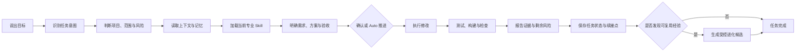
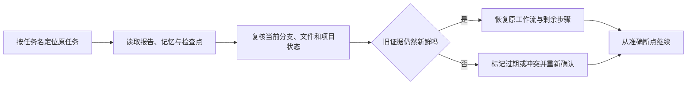

<h1 align="center">DevCodex</h1>

<p align="center">
  <strong>意图驱动的跨宿主 AI Coding 工程化 Harness</strong>
</p>

<p align="center">
  <strong>让 AI Coding 不只是生成代码，而是从需求开始，持续把工程任务做完。</strong>
</p>

<p align="center">
  识别意图 · 读取项目 · 调用专业 Skill · 确认边界 · 自动推进 · 执行修改 · 验证结果 · 保存进度 · 跨会话续接 · 受控进化
</p>

<p align="center">
  <a href="https://www.npmjs.com/package/devcodex"></a>
  <a href="./LICENSE"></a>
  =18.17.0" />
  
  
</p>

<p align="center">
  <a href="https://devcodex-labs.github.io/devcodex/">完整文档</a>
  ·
  <a href="https://devcodex-labs.github.io/devcodex/guide/getting-started">5 分钟开始</a>
  ·
  <a href="https://devcodex-labs.github.io/devcodex/examples/resume">跨会话续接案例</a>
  ·
  <a href="https://github.com/devcodex-labs/devcodex/issues">反馈问题</a>
</p>

> **模型和宿主负责推理、写代码与执行工具；DevCodex 以任务意图为起点，负责判断要完成什么、作用于哪个项目、该读取什么、加载哪些专业能力、按什么工程流程推进，以及怎样证明真正完成。**

**意图驱动 · 6 个 AI Coding 宿主 · 8 条任务工作流 · 80+ 专业 Skill · 项目上下文与记忆 · Sticky Auto 自动推进 · 长任务恢复 · 跨会话续接 · 证据化完成 · 受控自我进化**

```bash
npm install -g devcodex
cd <你的项目根目录>
devcodex init
devcodex status
```

安装或更新后，请完全退出旧会话，再从当前项目重新打开你使用的 AI Coding 工具。

第一个任务可以直接这样说：

```text
分析当前项目最值得优先解决的三个问题。
先说明读取范围和证据，只分析，不修改文件。
```

---

## 为什么需要 DevCodex？

模型越来越会写代码，但真实工程任务仍然经常失败在代码生成之外：

- 新会话不了解项目，每次都要重新解释背景；
- 需求还没有说清楚，AI 就开始修改文件；
- 长任务跨文件、跨阶段后容易偏离目标；
- 会话中断后，只能依靠旧聊天摘要猜测做到哪里；
- 通用模型缺少当前问题需要的专业工程方法；
- 简单任务和高风险任务被用同一种方式处理；
- 一句“已经完成”没有测试、证据和剩余风险；
- 同样的问题反复出现，却没有沉淀成下一次可复用的能力；
- 切换 Codex、Claude Code 或 Cursor 后，项目工作方式又要重新维护一套。

DevCodex 补上的，就是 AI Coding 与真实软件工程之间缺少的这一层。

| 只依赖当前 AI Coding 会话 | 加上 DevCodex |
|---|---|
| 背景主要留在聊天窗口 | 项目上下文、任务状态、报告和记忆跟随项目保存 |
| 容易拿到需求就直接编码 | 先判断目标、项目、范围、风险和是否允许修改 |
| 主要依赖模型的通用能力 | 根据任务和阶段加载对应的专业 Skill |
| 长任务中断后从头分析 | 从任务身份、检查点、确认状态和剩余项继续 |
| 大项目每轮重复读取 | 可按变化范围和影响关系做增量分析与复证 |
| “代码写完”等于“任务完成” | 测试、构建、报告、证据和剩余风险共同收口 |
| 项目经验散落在对话里 | 重复问题可形成受控进化候选和项目 Skill |
| 每个工具单独维护规则 | 六个宿主复用同一套项目工程方法 |

### 意图驱动：你只需要说目标，DevCodex 决定怎样工作

DevCodex 不要求用户先学习工作流名称，也不会看到某个关键词就机械套用固定 Prompt。它会先理解你真正想得到的结果，再决定接下来应该怎样工作。

它会同时判断：

- 最终需要的是结论、代码修改、问题修复、系统审查，还是继续历史任务；
- 请求作用于哪个项目，允许处理哪些目录、模块和业务范围；
- 当前任务的风险有多高，是否允许修改文件；
- 需要读取哪些 Profile、相关源码、历史记忆和验证证据；
- 当前阶段应该加载哪些专业 Skill；
- 哪些节点需要用户确认，哪些可以由 Auto 持续推进；
- 应该运行哪些验证，以及什么条件下才能宣布完成。

| 你的请求 | DevCodex 识别后的工程路径 |
|---|---|
| “分析测试为什么失败，不要修改” | 进入只读分析，说明读取范围、证据与未验证部分 |
| “复现并修复这个失败用例” | 进入修复流程，先复现、定位根因，再修改和回归 |
| “为支付回调增加幂等” | 进入开发流程，先明确需求、方案、范围与验收 |
| “审查当前支付链路的风险” | 进入证据审查，不默认修改文件 |
| “继续支付回调幂等任务” | 定位原任务，复核当前状态后从准确断点续接 |
| “这个设计是否合理？” | 先判断只需要分析建议，还是最终需要落地修改 |

意图不是一次性的分类标签，而是整条工程链的控制起点：

```text
用户目标
→ 任务类型
→ 目标项目、范围与风险
→ 上下文与记忆
→ 专业 Skill
→ 工作流与确认方式
→ 验证和完成标准
```

当用户目标发生变化，例如从“只分析”变成“按方案实施”、从单项目扩大到整个 workspace，或临时增加提交与发布要求，DevCodex 会重新判断工作流、上下文、权限和验证边界，而不是沿用旧任务的读写权限继续执行。

> Auto 只负责在已经识别的意图和已授权范围内持续推进，不会绕过意图判断，也不会把只读分析自动变成代码修改。

### 从需求到交付的完整闭环



DevCodex 不是在开始前多塞一段 Prompt，而是持续管理任务从理解、执行到验证和交接的全过程。

### 同一个模型，为什么会表现得更聪明？

DevCodex 不改变模型参数。它通过四件事提升 AI 在真实项目中的有效表现：

1. **给出正确目标**：先判断最终要结论、修复、功能、审查还是续接；
2. **提供正确资料**：只读取当前任务需要的项目规范、源码、记忆和证据；
3. **调用正确能力**：在当前阶段加载对应的专业 Skill，而不是一次性塞入全部规则；
4. **获得真实反馈**：测试、构建、命令结果、代码差异和审查证据会继续影响后续判断。

简单任务可以走更短路径；涉及公共契约、数据、安全、多模块或发布风险时，会自动提高确认和验证强度。

### Auto 自动推进：一次授权，持续完成整条工程链

普通模式下，DevCodex 会在需求、方案和实施计划等关键节点等待确认。需要让 AI 在已授权范围内持续推进时，可以显式进入 Auto：

```text
@devcodex-auto 完成支付回调幂等修复。
先复现和确认根因，再完成方案、修改、相关回归、报告与任务收口；
不要扩大到删除、push 或发布。
```

Auto 不会跳过工程流程，而是**自动通过适用的流程确认，并继续执行后面的分析、实施、验证、报告和状态保存**：

- 有效入口命中后，同一会话会以 Sticky Auto 持续保持自动推进，不需要每个阶段反复回复“继续”；
- 需求、方案、实施计划、测试、证据和报告仍然会生成，不会因为自动推进而消失；
- 可恢复失败最多自动重试 2 次；实际修改范围扩大、证据过期、验证失败或遇到不可恢复问题时，会停止并说明原因；
- 删除、项目外写入、危险操作、push、Tag、Release 和发布不会因为进入 Auto 自动获得授权；
- 不同宿主对 Hook、权限和自动放行的支持不同，无法安全自动执行时会退回确认或明确提示。

正式入口是 `@devcodex-auto`，默认快捷别名是 `@rocky`。在同一会话中可用 `退出 auto`、`关闭自动模式` 或 `切回确认模式` 退出；新会话需要重新授权。

> Auto 的价值不是“跳过步骤”，而是让已经明确目标和边界的任务不再被机械确认打断，同时继续保留验证、证据和安全底线。

<details>
<summary><strong>为团队设置自己的 Auto 别名</strong></summary>

在 Profile 的 `config.json` 中设置：

```json
{
  "extensions": {
    "devcodex": {
      "autoAliases": ["@team-auto"]
    }
  }
}
```

非空数组会替换默认快捷别名 `@rocky`；空数组 `[]` 会关闭默认快捷别名。正式入口 `@devcodex-auto` 不会被重命名。

</details>

---

## 安装后，你能解决什么？

### 1. 跨会话恢复：任务不再困在旧聊天窗口里

DevCodex 的续接不是“读一段旧会话摘要，然后继续猜”。

对正式任务，它会持续保存可恢复的工程状态，包括：

- 任务身份和原始目标；
- 已确认范围、非目标和验收标准；
- 当前工作流与所处阶段；
- 已完成步骤、未完成步骤和停止位置；
- 修改过的文件与关键决策；
- 已运行的验证、结果和证据；
- 剩余风险、阻塞项和下一步；
- 原任务已经获得和没有获得的权限。

新会话收到：

```text
继续支付回调幂等修复任务。
```

会先完成以下恢复过程：



恢复后仍然遵守原来的边界：原任务只读，续接后仍然只读；原任务没有 `push` 或发布权限，换会话后也不会自动获得。

这带来几个实际结果：

- 不需要重新粘贴几十轮旧对话；
- 不会把相似任务错误地串在一起；
- 不会因为换会话就忘记已经确认的范围；
- 当前代码已经变化时，不会直接沿用过期方案；
- 可以把未完成任务交给新的会话继续；
- 在支持的宿主之间，也可以基于同一项目中的任务文件、报告和证据接力。

> 跨宿主接力复用的是项目工程状态，不是无条件搬运某个宿主的完整聊天会话。Hooks、MCP、权限和自动化强度仍取决于目标宿主。

<details>
<summary><strong>长任务恢复为什么更可靠？</strong></summary>

- 恢复状态按正式任务保存，而不是每次 Hook 或工具事件都生成一份完整快照；
- 每个任务使用稳定检查点，写入失败时保留上一份有效状态；
- 已形成安全断点的任务可以收敛为更小的恢复记录；
- 已结束任务退出活跃恢复区，不持续制造无意义状态；
- 状态存储按字节进行容量保护，达到压力边界时不会静默删除活跃任务；
- 普通只读事件不会不断写入完整任务状态。

这些机制让跨会话恢复适合真正的长任务，而不是只适合短对话演示。

</details>

完整案例见[跨会话续接](https://devcodex-labs.github.io/devcodex/examples/resume)。

### 2. 项目 Profile、上下文、记忆与可复用项目知识

**Profile 可以理解为 AI 使用当前项目时的工程说明书。** 它记录项目结构、技术栈、构建与测试命令、代码风格、架构边界、发布方式、功能清单和用户契约，让 AI 不必每次都从目录和 `package.json` 重新猜测项目规则。

`devcodex init` 生成的是一份**有证据的 Profile 初稿和模板**，不是自动完成的最终事实。初始化后应让 AI 继续读取真实源码、脚本、CI、文档、配置和发布流程，把模板补充成当前项目可依赖的工程基线；无法从项目证明的内容必须保留为 `unverified`，不能编造。

Profile 也不是永久正确的缓存。项目级分析和审查会把 Profile 声明与当前代码、配置和运行证据重新对账；发现漂移时，以当前可验证事实为准，并把 Profile 修订作为后续任务。

没有完整 Profile 时，DevCodex 仍可以读取当前文件并处理有限任务，但会失去可靠的项目级工程基线：`status` / `doctor` 会显示 `missing` 或 `partial`，运行模式使用更保守的 `prod` 默认（这里只表示保守规则模式，不代表自动部署到生产），无法确认的项目事实保持未验证，依赖构建、测试、发布或架构边界的任务可能要求补充信息、降级或停止。多项目 workspace 中，如果目标项目的 Profile 根整体缺失，会返回 `PROFILE_MISSING`，而不是误用另一个项目的 Profile。

DevCodex 把三类信息分开处理：

| 类型 | 解决什么问题 |
|---|---|
| **项目说明** | 项目怎样构建、测试、发布，目录、技术栈和安全边界是什么 |
| **当前上下文** | 这次任务真正需要读取哪些代码、文档、配置和证据 |
| **任务记忆** | 已确认什么、做过什么、验证过什么、还剩什么 |

在大型、多轮项目分析中，还可以把已经验证的稳定事实、文件关系和影响范围形成可复用的项目知识：

- 文件没有变化且证据仍然有效时，不必每轮重新分析；
- 文件变化后，只让变化文件及其依赖、消费者、配置和测试范围失效；
- 分析目标变化但代码没变时，只补充新的分析视角；
- 快照、文件身份或抽样复证不一致时，自动退回完整读取；
- 大项目可以分批交付结果，而不是长时间无输出后一次性给出总结。

这不是“缓存一段自然语言总结”，而是带来源、范围、新鲜度和失效条件的项目认知。

### 3. 意图变化时，流程与权限会重新判断

意图识别不是任务开始时的一次性标签。用户补充范围、改变最终目标、切换项目，或从“只分析”改为“按方案实施”时，DevCodex 会重新判断：

- 当前应继续原工作流，还是切换到开发、修复、分析、审查或续接；
- 是否需要读取新的项目上下文和记忆；
- 是否需要增加或移除专业 Skill；
- 原来的只读、修改、提交和发布权限是否仍然成立；
- 既有计划、证据和验证范围是否已经过期。

这避免 AI 因为第一轮判断已经完成，就在用户目标改变后继续沿用旧流程、旧上下文或旧权限。

### 4. 80+ 专业 Skill 按需加入

DevCodex 内置 80+ 专业 Skill，覆盖：

- 需求澄清、产品策略、验收与技术方案；
- 前端、交互、设计系统和可访问性；
- 后端、领域建模、API、数据与分布式系统；
- 安全、隐私、外部集成和威胁建模；
- Bug 复现、根因、回归范围、测试与审查；
- 性能、生产就绪、SRE、发布与文档同步；
- 上下文、记忆、宿主能力、Skill 生命周期和工程治理。

Skill 只在匹配当前任务和阶段时加载。看到仓库中存在某个 Skill，不等于它已经被全部送进模型。

项目还可以添加自己的 Skill，把业务规则、团队规范、架构约束、常见问题和验证方式变成 AI 可重复使用的工程能力。

### 5. 从需求到验证，不允许任务静默跑偏

新功能会从目标、范围、非目标和验收开始；复杂任务还会形成方案、实施顺序、验证和回滚策略。

执行过程中如果实际范围明显扩大、出现新的公共契约或高风险操作，DevCodex 会暂停并回到确认阶段，而不是把临时发现悄悄扩写成新的需求。

### 6. 证据化完成：不是 AI 说完成，而是有证据地完成

完成需要回答：

- 修改了什么；
- 为什么这样修改；
- 执行了哪些测试、构建或检查；
- 命令结果是什么；
- 哪些范围已经验证；
- 哪些范围没有验证；
- 还剩什么风险；
- 下一步是否需要提交、推送或发布。

没运行的验证不能写成已通过；测试成功也不能自动获得提交或发布授权。

### 7. 受控自我进化：让项目经验逐步变成资产

当某类问题反复出现、流程经常返工，或现有 Skill 无法覆盖时，DevCodex 可以：

```text
重复问题 / 返工 / 新经验
        ↓
识别能力缺口和根因
        ↓
生成 Skill、规则、Prompt 或验证方案候选
        ↓
小范围试运行和效果验证
        ↓
人工审查与批准
        ↓
沉淀为工作区或项目能力
```

候选默认不会直接进入实际工作流，也不会自动覆盖当前规则或发布。只有目标明确、证据充分、目的地正确并获得授权后，才会晋级为可用能力；无效或有害的改进可以拒绝、回滚或退役。

**这不是让 AI 随意修改自己，而是让经过验证的工程经验能够安全积累。**

#### 进化候选怎样真正变成 Skill？

```text
重复问题或返工证据
        ↓
写入 evolution/candidates 候选区
        ↓
判断应沉淀到 workspace、单个项目还是上游包
        ↓
补齐适用场景、反例、验证和回滚证据
        ↓
人工批准晋级
        ↓
生成 SKILL.md + intent.json 到活动目录
        ↓
用自然语言正反例测试路由，失败则修订或回退
```

关键边界：

- 候选区不是活动 Skill 目录，候选生成后不会自动参与任务路由；
- 默认优先沉淀为 workspace Skill，只有明确依赖单一项目时才进入项目级 Skill；
- 修改 DevCodex 上游内置 Skill 需要维护者单独授权，不能由普通项目自动写回发行包；
- 只有候选、目标位置、验证证据和晋级授权全部成立，AI 才能生成最终 `SKILL.md` 与 `intent.json`；
- 生成后还要用正例、反例和真实自然语言请求验证“何时应该加载、何时不应该加载”。

`devcodex init` 只负责准备隔离目录，不会把每次对话自动转成 Skill：

```text
.devcodex/workspace/evolution/candidates/   候选
.devcodex/workspace/evolution/evidence/     问题、试运行与效果证据
.devcodex/workspace/evolution/decisions/    目标、审批与晋级决定
```

批准后的活动目标由复用范围决定：

| 目标 | 活动目录 | 约束 |
|---|---|---|
| workspace Skill | `.devcodex/workspace/skills/<id>/` | 默认选择，同一 workspace 复用 |
| project Skill | `.devcodex/<project>/skills/<id>/` | 必须有项目专属证据 |
| DevCodex 上游 Skill | `content/skills/<id>/` | 必须有维护者明确授权，并重新走发布流程 |

当前公开 CLI 没有“一键把候选直接变成活动 Skill”的命令。晋级由受控 AI 工作流完成：先形成并批准目标决定，再由 `workspace-skill-author` 生成 `SKILL.md` 与 `intent.json`，最后执行正反例和自然语言路由验证。

可以直接这样要求：

```text
审查当前 workspace 的进化候选，找出与支付回调重复处理相关的候选。
先判断它应该沉淀为 workspace Skill 还是项目 Skill，列出证据、适用场景、反例、验证和回滚方案。
未经我批准不要晋级；我确认后，再生成 SKILL.md 与 intent.json，并用自然语言正反例测试路由。
```

没有历史候选时，也可以直接创建项目自己的 Skill：

```text
为当前 workspace 创建 payment-webhook-reliability Skill。
它用于支付回调幂等、签名校验、状态机、重复通知和补偿检查；
请同时生成适用场景、正反例和验证步骤，并用自然语言测试一次路由。
```

### 8. 六个 AI Coding 宿主复用同一套工程方式

DevCodex 当前面向：

```text
Codex · Claude Code · GitHub Copilot · Gemini CLI · Grok · Cursor
```

项目上下文、任务记忆、专业 Skill、确认边界、验证和报告尽量保持一致；同时根据宿主实际支持的 Hook、MCP、插件、权限和生命周期事件选择可执行路径。

缺少某种宿主能力时，DevCodex 会降级、提示或保持未验证，而不是假装六个工具完全相同。

### 9. 上下文复用，但不以错误复用换速度

当任务、会话、项目、上下文版本和正文身份完全一致，并且已确认正文已经送达时，DevCodex 可以复用轻量描述，避免重复传输同一大段内容。

任一身份或内容发生变化，就恢复完整读取。这样既减少无意义重复，又不会因为错误缓存让 AI 在过期上下文上继续工作。

### 10. 多任务可以判断是否安全并行

当一个项目同时存在多个需求、问题或优化任务时，DevCodex 可以先检查：

- 是否修改相同文件；
- 是否竞争同一任务状态、报告或记忆；
- 是否共享配置、发布文件或验证入口；
- 是否具备明确的合并顺序、冲突检查和停止条件。

只有写入面和汇合协议都能证明安全时才建议并行；无法证明时保持串行。它不是通用多 Agent 编排框架，但可以避免“为了并行而并行”造成的工程冲突。

### 11. 权限、Git 和发布动作不会被一句话无限放大

分析、修改、删除、提交、切换分支、推送、Tag、Release 和发布是不同动作。

DevCodex 默认保持当前分支，不会因为普通开发任务自动创建分支、提交、推送或发布。涉及危险操作、项目外写入或清理时，需要更明确的授权和可证明的目标范围。

### 12. 状态、诊断与恢复路径可检查

```bash
devcodex status
devcodex doctor --json
devcodex runtime status --json
devcodex runtime maintenance --dry-run --json
```

状态会区分“配置存在”“适配器合同通过”“原生宿主已验证”和“端到端可用”，不会把文件存在冒充成真实能力。

---

## 什么时候直接使用宿主，什么时候用 DevCodex？

| 场景 | 更合适的选择 | 原因 |
|---|---|---|
| 一次性问答、极小编辑、只依赖某个宿主特有工具 | 直接使用宿主 | 最快，不需要任务状态、报告或续接链 |
| 跨文件或跨模块开发 | DevCodex | 需要需求、方案、执行边界和验证闭环 |
| 修复问题并担心同类回归 | DevCodex | 会串联复现、根因、同类路径和定向回归 |
| 需求不完整或风险较高 | DevCodex | 先明确范围、非目标、验收和授权 |
| 长任务会跨多个会话 | DevCodex | 保存任务身份、检查点、证据和剩余项 |
| 大型项目需要多轮分析 | DevCodex | 支持分批交付、项目知识和选择性失效 |
| 需要审计、交接或留下证据 | DevCodex | 报告、验证结果和未覆盖范围可查 |
| 希望团队经验持续沉淀 | DevCodex | 可创建项目 Skill 和受控进化候选 |

DevCodex 不替代 Codex、Claude Code、Cursor 等宿主。宿主提供模型、界面和原生工具；DevCodex 提供项目层的工程工作方式。

---

## 5 分钟开始

### 1. 检查环境

需要 Node.js `>=18.17.0` 和 npm。

```bash
node -v
npm -v
```

### 2. 安装

```bash
npm install -g devcodex
devcodex --version
```

正常安装会刷新用户级宿主适配器。如果包管理器禁用了安装脚本，或后续 `status` 显示适配器未就绪，可执行：

```bash
devcodex global-adapters apply
```

### 3. 初始化项目

```bash
cd <你的项目或 workspace 根目录>
devcodex init
devcodex status
```

`devcodex init` 会准备 `.devcodex/` 运行目录、任务状态、记忆、工作区 Skill 与进化候选目录，并生成 workspace 的基础 Profile 初稿。它不会自动修改业务源码，也不会把模板中的未确认内容当成项目事实。希望先查看将要创建什么时，可以先运行 `devcodex init --dry-run`。

#### 初始化后：让 AI 完善项目 Profile（强烈推荐）

先预览项目适合的 Profile 档位，再生成需要的模板：

```bash
# 先查看当前档位、推荐档位和将要生成的文件
devcodex profile plan

# 再按项目实际选择档位；下面以常规业务项目为例
devcodex profile init --tier profile-standard

devcodex status
```

然后在当前项目的新会话中直接说：

```text
完善当前项目的 DevCodex Profile。
请读取真实的 package.json、目录结构、源码、lint/test/build 脚本、CI、文档、配置和发布流程，
逐项补充项目结构、架构边界、代码风格、测试规范、发布规范和功能清单。
只写能够从项目证据证明的事实；无法确认的内容保留为 unverified，不要编造。
完成后检查 Profile 与当前代码是否一致，并运行 devcodex status 和 devcodex doctor --json。
```

`status` / `doctor` 主要检查 Profile 的路径、档位、必需文件和结构状态；Profile 是否真正符合业务和源码，仍以 AI 的证据化复核与用户确认结果为准。

<details>
<summary><strong>Profile 档位、多项目与覆盖规则</strong></summary>

| Profile 档位 | 适合的项目 | 主要内容 |
|---|---|---|
| `profile-lite` | 小型项目或首次体验 | 项目信息、架构约束、代码风格和基础配置 |
| `profile-standard` | 大多数真实业务项目 | 增加测试规范、发布规范和功能清单 |
| `profile-closed-loop` | SDK、CLI、框架、公开 API 或文档站 | 再增加用户文档与契约规范 |

`profile plan` 只预览，不写文件；已有文件默认保留，升级档位只补缺失内容。`--force` 可能覆盖 DevCodex 管理的 Profile 文件，执行前应先查看计划与 Git diff。

多项目 workspace 可以为指定项目单独初始化：

```bash
devcodex init --profile <项目相对路径> --dry-run
devcodex init --profile <项目相对路径>
```

workspace Profile 作为公共基线，项目 Profile 只覆盖该项目自己的差异，不会把另一个项目的规则误用到当前项目。

</details>

### 4. 重新打开宿主会话

完全退出旧会话，再从当前项目重新打开 Codex、Claude Code、GitHub Copilot、Gemini CLI、Grok 或 Cursor。已经打开的旧会话不会在中途自动加载新安装版本。

### 5. 发起第一个任务

```text
分析当前项目最值得优先解决的三个问题。
先说明读取范围和证据，只分析，不修改文件。
```

你应该看到：

- 它先识别任务意图、目标项目和读写边界；
- 说明读取了哪些资料、哪些没有读取；
- 结论能够指向代码、配置、文档或命令结果；
- 推断和未验证范围会明确标注；
- 不会在只读分析中修改业务文件。

完整步骤见[5 分钟开始](https://devcodex-labs.github.io/devcodex/guide/getting-started)。

---

## 安装会改变什么

| 位置 | 行为 |
|---|---|
| 用户 HOME | 安装或刷新 DevCodex 管理的宿主适配器与运行文件 |
| 当前项目 / workspace | 执行 `devcodex init` 后创建或刷新 `.devcodex/` |
| 业务源码 | 安装与初始化本身不会自动修改 |
| 后台服务 | 普通使用不启动 DevCodex 自己的常驻网络服务 |
| 宿主原生配置与 Skill | 不扫描、复制、合并、覆盖或删除用户自己的资产 |

项目说明、任务状态、报告、记忆和项目 Skill 默认保存在项目目录中。模型推理、联网、认证、沙箱和数据处理仍由你选择的 AI Coding 宿主负责。

DevCodex 不代理模型请求，也不会把“项目状态保存在本地”夸张成“代码绝不会离开本机”；宿主是否上传上下文、保存聊天或使用联网工具，应以对应宿主和组织策略为准。

> 当前版本的 `devcodex init` 会生成基础 Profile 初稿；它只负责建立可编辑模板和已检测事实。最终 Profile 仍应由 AI 结合真实项目补全，并由用户或团队确认。

---

## 工作流、Skill 与宿主边界

### 8 条任务工作流

用户不需要先学习工作流名称。说出最终目标后，DevCodex 会选择合适路径。

| 工作流 | 用途 | 默认是否修改文件 |
|---|---|---:|
| `dev` | 功能开发、重构或文档实施 | 确认后修改 |
| `fix` | 复现、定位并修复问题 | 确认后修改 |
| `analyze` | 只读分析与研究 | 否 |
| `audit` | 基于证据的系统审查 | 否 |
| `resume` | 恢复已有任务 | 继承原任务边界 |
| `chat` | 普通交流 | 否 |
| `self-fix` | 修复 DevCodex 自身规则或流程 | 高级入口，确认后修改 |
| `other` | 无法安全归类时先规划 | 否 |

其中 `dev`、`fix`、`analyze`、`audit`、`resume`、`chat` 是六条主工作流；`self-fix` 和 `other` 是高级或兜底路径。

### 80+ 专业 Skill

公开摘要使用 **80+**。当前 Skill 覆盖四类能力：

| 分类 | 主要内容 |
|---|---|
| Workflow & Routing | 任务判断、阶段、确认路径、开发、修复、分析与审查 |
| Domain & Architecture | 产品、体验、前后端、API、数据、安全、性能与系统架构 |
| Quality & Delivery | 测试、审查、文档、验证、报告、发布和交付收口 |
| Runtime & Governance | 宿主、上下文、记忆、Skill 生命周期、策略和运行治理 |

工作区 Skill 是项目级扩展，不会自动混入内置 Skill 统计，也不会在未经批准时从进化候选直接进入活动路由。

### 六宿主入口与当前边界

| 宿主 | 推荐入口 | 说明 |
|---|---|---|
| GitHub Copilot | Copilot CLI；VS Code / JetBrains 使用指令回退 | 不同入口能力不同 |
| Claude Code | Claude Code | 以当前直接证据支持范围为准 |
| Codex | Codex App / CLI | Hook 与 MCP 能力取决于宿主配置 |
| Gemini CLI | Gemini CLI | 适配存在，真实回放证据不足时保持未验证 |
| Grok | `devcodex grok` | 推荐使用 DevCodex 启动入口 |
| Cursor | 本地 IDE / CLI | 本地与 Cloud Agent 必须分别判断 |

精确兼容状态见[六宿主能力边界](https://devcodex-labs.github.io/devcodex/reference/hosts)。

### DevCodex 与宿主各自负责什么？

| DevCodex 负责 | AI Coding 宿主负责 |
|---|---|
| 任务和项目识别、上下文、记忆与专业 Skill | 模型推理和原生 Agent 循环 |
| 确认与授权边界、验证、报告、证据和续接 | 主要工具执行、会话传输与生命周期 |
| 六宿主适配和共享工程流程 | 认证、沙箱、联网与运行环境 |

---

## 常见任务怎么说

### 开发功能

```text
为当前项目增加 <功能>。
先整理目标、范围、非目标和验收标准，再给出方案。
我确认后再修改；完成后运行相关验证并报告剩余风险。
```

### 修复缺陷

```text
修复 <问题>。
先复现并定位根因，检查同类路径和回归范围。
确认方案后再修改，完成后用验证证据证明原问题已经消失。
```

### 只读分析

```text
分析当前架构最值得优先解决的三个问题。
给出代码证据、影响和优先级，只分析，不修改文件。
```

### 系统审查

```text
审查当前项目的支付回调、幂等和状态一致性。
只读，不修改文件；按风险排序并给出证据和未检查范围。
```

### 继续历史任务

```text
继续支付回调幂等修复任务。
先读取原任务的确认状态、报告、验证证据和剩余风险，
复核当前代码是否变化，再从准确断点继续。
```

### 大型项目增量分析

```text
深度分析当前项目，按模块分批交付结果。
保存可复用的项目知识；后续只重算变化文件、影响范围和新的分析视角。
每批都给出证据、覆盖范围和检查点。
```

### 分析能力缺口并形成进化候选

```text
分析最近重复出现的返工、回归和用户反馈。
找出当前 Skill 或流程缺口，生成改进候选和验证方案。
候选先不要自动生效，也不要发布。
```

### 判断多个任务是否可以并行

```text
检查下面三个任务是否可以安全并行。
列出各自允许修改的路径、共享状态、冲突风险、合并顺序和停止条件；
无法证明安全时保持串行。
```

### 使用 Auto 自动推进

```text
@devcodex-auto 完成当前需求。
从需求与项目事实开始，自动推进适用的确认、方案、实施、验证、报告和任务状态保存；
范围扩大、验证失败或遇到高风险动作时停止并报告。
允许修改当前项目已确认范围内的文件，但不要删除、push、Tag、Release 或发布。
```

正式自动入口是 `@devcodex-auto`，默认快捷别名是 `@rocky`。`extensions.devcodex.autoAliases` 的非空数组会替换默认别名，空数组 `[]` 会关闭默认别名。Auto 在同一会话内持续有效；输入 `退出 auto` 或 `切回确认模式` 可退出。自动入口不会扩大删除、推送或发布权限。

更多示例见[常见任务](https://devcodex-labs.github.io/devcodex/guide/common-tasks)与[任务教程](https://devcodex-labs.github.io/devcodex/tutorials/ambiguous-request)。

---

## 常见问题与排错

### DevCodex 会让模型本身变强吗？

不会改变模型参数、权重、上下文窗口或基础推理上限。它通过正确目标、项目上下文、专业 Skill、工作流、工具、记忆、验证和证据链，让同一个模型在真实工程中表现得更可靠。

### 跨会话恢复需要什么前提？

任务进度、确认状态和验证证据必须已经写入项目。只有聊天窗口中存在、项目中没有留下状态的任务，无法可靠恢复。

### 可以从 Codex 切换到 Claude Code 或 Cursor 后继续吗？

可以基于同一项目中的需求、报告、任务记忆和检查点接力，但不是无条件复制完整聊天会话。目标宿主需要能够读取这些项目文件，具体 Hook、MCP 和自动执行能力仍以宿主实际支持为准。

### 当前文件已经变化，还会直接按旧计划继续吗？

不会把旧记录当成永久真相。续接会复核当前项目、分支、文件身份和证据新鲜度；出现冲突、过期或范围漂移时，应先重新分析或确认。

### DevCodex 会自动修改、提交或发布吗？

`analyze` 和默认 `audit` 只读；`dev` 与 `fix` 在确认后修改。Auto 只会自动通过适用的工程确认并在当前会话继续执行，不会跨新会话继承授权。提交、推送、Tag、GitHub Release 和 npm publish 仍需要按动作独立、明确授权。

### 使用 Harness 会不会让所有小任务都变慢？

不会用完全相同的强度处理所有任务。低风险、范围清晰的小任务可以缩短产物和验证路径；公共契约、数据、安全、多模块和发布任务会使用更严格的确认与复审。

### 安装后为什么没有看到工作流或 Skill？

先完全退出旧会话，再从目标项目打开新会话，然后运行：

```bash
devcodex status
devcodex doctor --json
devcodex global-adapters apply
```

不要只根据配置文件存在判断能力已经生效。状态中的 configured、adapter contract、native probe 和最终 readiness 是不同证据层。

### 数据会不会离开本机？

DevCodex 普通使用不需要自己的常驻网络服务，也不代理模型请求；但真正的模型调用和数据处理由当前宿主完成。代码是否上传、聊天是否保存、联网工具是否启用，应查看宿主、账号和组织策略。

### 可以添加项目自己的 Skill 吗？

可以。工作区 Skill 可用于沉淀业务规则、架构约束、团队流程和验证方式。可以直接要求 AI 创建，也可以从进化候选经过证据、目标判断和人工批准后晋级。候选不会直接变成活动 Skill。

### 状态异常怎样排查？

```bash
devcodex status --json
devcodex doctor --json
devcodex runtime status --json
```

完整决策树见[故障排查](https://devcodex-labs.github.io/devcodex/guide/troubleshooting)。

---

## 更新

先更新 npm 包和用户级宿主适配器：

```bash
npm update -g devcodex
devcodex --version
devcodex global-adapters apply
```

再进入正在使用的项目或 workspace，预览并刷新项目运行内容：

```bash
cd <你的项目或 workspace 根目录>
devcodex update --dry-run
devcodex update
devcodex status
```

`devcodex update` 只刷新当前 workspace 的 DevCodex 运行内容，不会自动覆盖或升级已经由团队维护的 Profile。项目事实变化时，应让 AI 单独复核并更新 Profile。

更新后请完全退出旧会话，再从目标项目打开新会话。旧会话不会在运行中热切换到新版本。

---

## 卸载

先预览 DevCodex 管理的用户级资产，再显式清理，最后卸载 npm 包：

```bash
devcodex uninstall --dry-run
devcodex uninstall --apply
npm uninstall -g devcodex
```

请不要先执行 `npm uninstall -g devcodex`，否则安全清理宿主适配器的命令也会一起消失。

普通卸载只移除能够证明由 DevCodex 管理的用户级宿主适配器和运行资产：

- 用户自己的宿主配置、指令、原生 Skill 和个人资产会保留；
- 所有权无法证明的文件不会冒险删除；
- 项目中的 `.devcodex/` 默认保留，因为其中可能包含 Profile、需求、问题、报告、任务记忆、检查点、工作区 Skill 和进化候选；
- 以后重新安装时，可以继续使用这些项目工程资产。

如果确认永久放弃某个项目中的 DevCodex 数据，应先备份或审查 `.devcodex/`，再由用户手动删除。DevCodex 不会在全局卸载时自动清空项目历史。

---

## 边界

- DevCodex 不是新的 Coding Agent，也不是模型网关；
- 它不是通用 Agent 框架或多 Agent 编排器；
- 它不替代业务框架、GitHub CI、安全审计或人工评审；
- 它不会让六个宿主凭空拥有完全相同的 Hook、MCP、插件和权限；
- 项目状态保存在本地文件，不代表宿主处理的数据永远不会离开本机；
- 没有执行的验证不能声称已经通过；
- 报告和记忆可以帮助恢复任务，但不能绕过当前代码事实或重新获得危险操作权限；
- 受控进化默认只生成候选，不会未经批准直接修改活动规则或发布。

更多说明见[信任、安全与数据](https://devcodex-labs.github.io/devcodex/guide/trust-security-data)与[限制和边界](https://devcodex-labs.github.io/devcodex/reference/limits)。

---

## 文档

- [5 分钟开始](https://devcodex-labs.github.io/devcodex/guide/getting-started)
- [自动推进与常见任务](https://devcodex-labs.github.io/devcodex/guide/common-tasks)
- [意图驱动](https://devcodex-labs.github.io/devcodex/concepts/intent-driven)
- [DevCodex 如何工作](https://devcodex-labs.github.io/devcodex/concepts/architecture)
- [工作流总览](https://devcodex-labs.github.io/devcodex/workflows/)
- [项目上下文与记忆](https://devcodex-labs.github.io/devcodex/concepts/profile-context-memory)
- [Profile 与项目配置](https://devcodex-labs.github.io/devcodex/reference/configuration)
- [跨会话任务续接](https://devcodex-labs.github.io/devcodex/concepts/task-resume)
- [跨会话续接案例](https://devcodex-labs.github.io/devcodex/examples/resume)
- [专业 Skill](https://devcodex-labs.github.io/devcodex/reference/skills)
- [证据与完成](https://devcodex-labs.github.io/devcodex/concepts/evidence-and-completion)
- [六宿主能力边界](https://devcodex-labs.github.io/devcodex/reference/hosts)
- [CLI 命令](https://devcodex-labs.github.io/devcodex/reference/cli)
- [运行态维护](https://devcodex-labs.github.io/devcodex/reference/runtime-operations)
- [故障排查](https://devcodex-labs.github.io/devcodex/guide/troubleshooting)

---

## 贡献

DevCodex 仍在持续演进。Bug、真实使用反馈、宿主兼容问题、Skill 建议、文档改进和工程案例都欢迎通过 [Issues](https://github.com/devcodex-labs/devcodex/issues) 提交。

安全漏洞请按照仓库 [Security Policy](./SECURITY.md) 私下报告，不要先创建公开 Issue。

---
## 社区

本项目认可并感谢 [LINUX DO](https://linux.do/) 社区对开源开发者交流的支持。

## 许可证

[AGPL-3.0](./LICENSE)
