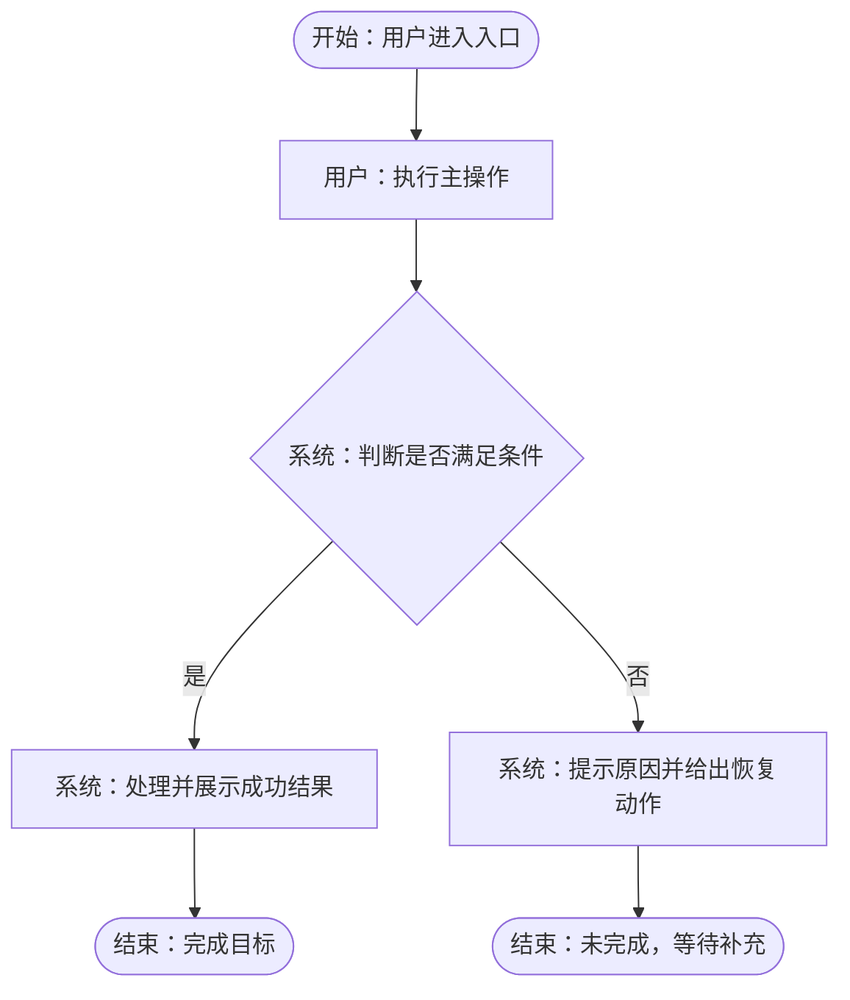

# 产品完整需求模板

> **路径**: `.devcodex/**/requirements/<中文描述>/01-产品需求.md`
> **触发**: 有产品经理或正式产品角色时，产品直接提供完整需求 / PRD / 产品说明；AI / 研发据此进入 CP2 技术方案

---

## 编写指引

> ⚠️ 本模板不是“产品补全 AI 草稿”的模板。它用于公司已有产品角色时，由产品直接提交完整产品需求，AI / 研发不再生成或重写产品需求。
> ⚠️ 无产品角色、研发兼产品或需求方只提供口头诉求时，使用 `00-需求概况.md` → AI 生成 `01-需求确认.md` 草稿 → 产品 / 需求方确认的链路；不要把两条链路混在一起。
> ⚠️ 产品完整需求是业务事实源：产品不填写验收标准、测试用例、数据库字段、接口 Schema、表结构、字段类型、内部 ID 或技术实现步骤。
> ⚠️ AI / 研发只做缺口 / 冲突检查和澄清，不生成或重写产品需求，不改写产品口径；缺口检查记录在 CP1 摘要、`02-技术方案.md` 或报告中，不放入产品填写模板正文。
> ⚠️ 技术方案必须从产品原文、流程节点、字段描述、样例、反例和异常边界派生数据库、接口、实现验收和测试策略。
> ⚠️ 涉及页面、表单、列表、弹窗、看板、配置台或其他用户可见交互时，必须填写前端交互；纯后端 / 纯 CLI / 纯文档可写 `N/A + 原因`。
> ⚠️ 流程类需求建议先写 Mermaid 主流程图，再写文字步骤图和节点解释；需求正文尽量跟着流程节点展开。
> ⚠️ 生成的 Markdown 产品需求文档必须在文档头部后补 `## 目录导航`。

---

## 文档头部

```markdown
# [产品需求名称]

> **版本**: v0.0.1
> **日期**: YYYY-MM-DD
> **状态**: 草稿 / 待确认 / 已确认 / 已变更
> **产品负责人**: [产品]
> **需求提出方**: [业务 / 运营 / 客户 / 老板 / 内部使用方]
> **研发负责人**: [可选]
> **目标用户 / 使用角色**: [角色]
> **优先级**: P0 / P1 / P2
> **目标版本 / 时间窗口**: [版本或日期]
> **确认状态**: 产品已确认 / 需求方待确认 / 研发待澄清 / 已冻结
> **需求类型**: 业务流程 / 页面交互 / 权重策略 / 配置台 / 数据展示 / 其他
```

---

## 目录导航

```markdown
## 目录导航

- [§0 使用场景与责任边界](#0-使用场景与责任边界)
- [§1 需求背景与业务目标](#1-需求背景与业务目标)
- [§2 范围、非范围与优先级](#2-范围非范围与优先级)
- [§3 用户角色、权限与使用场景](#3-用户角色权限与使用场景)
- [§4 流程图、文字步骤图与节点解释](#4-流程图文字步骤图与节点解释)
- [§5 页面与前端交互](#5-页面与前端交互)
- [§6 字段描述（非数据库字段）](#6-字段描述非数据库字段)
- [§7 业务规则、异常与边界](#7-业务规则异常与边界)
- [§8 示例、反例与附件](#8-示例反例与附件)
- [§9 依赖、风险与待确认问题](#9-依赖风险与待确认问题)
- [§10 版本变更记录](#10-版本变更记录)
```

---

## §0 使用场景与责任边界

> 本节用于说明这份文档为什么可以直接作为产品事实源。

| 项 | 产品填写 |
|----|----------|
| 是否有产品角色直接提供完整需求 | 是 |
| 是否跳过 AI 生成产品需求草稿 | 是，AI / 研发只做缺口检查 |
| 上游输入来源 | 需求方沟通 / 会议纪要 / 原型 / 设计稿 / 数据分析 / 客户反馈 / 其他 |
| 本文档确认人 | 产品负责人、需求提出方、关键业务方 |
| 技术方案入口 | `02-技术方案.md` 从本文档直接派生 |

**责任边界**：

- 产品负责写清业务目标、范围、流程、页面交互、字段描述、业务规则、示例、异常和待确认问题。
- AI / 研发负责检查缺口和冲突，必要时向产品提问；不得把未确认内容补成产品口径。
- 技术方案负责定义数据库字段、接口 Schema、状态模型、实现验收和测试策略。

## §1 需求背景与业务目标

| 项 | 产品填写 |
|----|----------|
| 为什么要做 | |
| 谁会使用或受影响 | |
| 当前痛点 / 机会 | |
| 业务目标 | |
| 业务成功信号 | 用户或业务方可观察到的变化；不是验收步骤 |
| 证据来源 | 用户反馈 / 工单 / 数据 / 运营观察 / 竞品 / 合规 / 老板决策 / 其他 |

## §2 范围、非范围与优先级

| 类型 | 内容 |
|------|------|
| 本次必须做 | |
| 本次应做但可降级 | |
| 本次不做 | |
| 后续再做 | |
| 不允许 AI / 研发自行扩展的边界 | |

| 编号 | 需求项 | 优先级 | 对应业务结果 |
|------|--------|:------:|--------------|
| F-01 | | 🔴 必须 / 🟡 应有 / 💡 增强 | |

## §3 用户角色、权限与使用场景

| 角色 | 能看到什么 | 能做什么 | 不能做什么 | 无权限提示 |
|------|------------|----------|------------|------------|
| | | | | |

| 场景 | 触发条件 | 用户目标 | 完成后的业务状态 |
|------|----------|----------|------------------|
| | | | |

## §4 流程图、文字步骤图与节点解释

> 流程类、页面类、审批类、策略类、权重配置类需求必须填写。纯静态文案或无行为流转的需求可写 `N/A + 原因`。
> 推荐顺序：Mermaid 主流程图 → 文字步骤图 → 节点解释 → 按节点展开业务规则、字段、状态、异常和样例。

### §4.1 Mermaid 主流程图



### §4.2 文字步骤图

| 步骤 | 触发方 | 做什么 | 用户看到什么 | 下一步 |
|------|--------|--------|--------------|--------|
| N1 | | | | |
| N2 | | | | |

### §4.3 节点解释

| 节点 | 类型 | 前置条件 | 业务动作 | 成功出口 | 失败 / 异常出口 | 产品说明 |
|------|------|----------|----------|----------|-----------------|----------|
| N1 | 入口 / 操作 / 判断 / 处理 / 异常 / 结束 | | | | | |

## §5 页面与前端交互

> 涉及用户可见 UI / 交互时必填；产品不写前端实现代码，只写用户可感知行为。

| 项 | 产品填写 |
|----|----------|
| 设计来源 | Figma / 原型 / 截图 / 既有页面 / 设计系统 / 文字说明 / 暂缺 |
| 页面入口 | |
| 页面结构 | 关键区域、列表、表单、弹窗、详情、操作区 |
| 主任务路径 | |
| 次要动作 | 返回、取消、撤销、筛选、批量、导出、重试 |
| 控件行为 | 按钮、开关、单选、多选、下拉、上传、拖拽、分页等 |
| 状态覆盖 | loading / empty / error / disabled / readonly / saving / success / failed |
| 表单校验 | 必填、格式、范围、重复、冲突、跨字段联动和错误文案 |
| 反馈方式 | toast / inline message / modal / badge / 状态变更 / 页面刷新 |
| 导航与退出 | 返回、关闭、离开未保存、保存后去哪里 |
| 高成本操作 | 删除、覆盖、发布、回滚是否二次确认，是否允许撤销或恢复 |
| 适配要求 | 桌面 / 移动 / 小屏 / 触摸 / 键盘 / 焦点 / 可访问性 |
| 前端文案 | 按钮、提示、空态、错误、成功提示和确认弹窗业务文案 |

## §6 字段描述（非数据库字段）

> 产品只写业务字段描述，不定义数据库字段、表结构、接口字段、类型长度、索引、外键或内部 ID。

| 字段 / 信息项 | 业务含义 | 出现位置 | 来源 / 录入方式 | 展示格式 | 是否可编辑 | 规则 / 示例 |
|---------------|----------|----------|-----------------|----------|------------|-------------|
| | | | 用户手填 / 系统计算 / 外部同步 / 历史继承 / 默认值 | | 是 / 否 | |

### §6.1 权重规则专项（条件）

> 涉及权重、排序、打分、分配比例、优先级计算或策略命中时必填。

| 项 | 产品填写 |
|----|----------|
| 权重对象 | |
| 权重目标 | |
| 因子列表 | |
| 因子来源 | 人工配置 / 系统计算 / 外部输入 / 默认值 |
| 计算或排序口径 | 用业务语言说明；不写代码公式或数据库字段 |
| 冲突处理 | 多规则同时命中时如何取舍 |
| 边界值 | 0、空值、最大值、并列、缺失、异常值 |
| 可解释性 | 用户是否需要看到原因、排序依据或命中规则 |

## §7 业务规则、异常与边界

| 编号 | 规则 | 适用流程节点 | 例外情况 | 产品口径 |
|------|------|--------------|----------|----------|
| R-01 | | N1 / N2 / N3 | | |

| 场景 | 用户可见表现 | 业务处理口径 | 是否人工介入 |
|------|--------------|--------------|----------------|
| | | | 是 / 否 |

## §8 示例、反例与附件

| 类型 | 场景 | 输入 / 条件 | 期望业务结果 | 说明 |
|------|------|-------------|--------------|------|
| 正例 | | | | |
| 反例 | | | | |
| 边界例 | | | | |

| 附件类型 | 链接 / 路径 | 用途 | 是否为事实源 |
|----------|-------------|------|:------------:|
| Figma / 截图 / 表格 / Word / 会议纪要 / 聊天记录 | | | 是 / 否 |

## §9 依赖、风险与待确认问题

| 类型 | 内容 |
|------|------|
| 业务依赖 | |
| 系统依赖 | |
| 数据依赖 | |
| 设计依赖 | |
| 外部约束 | |
| 明确风险 | |

| 编号 | 待确认问题 | 影响 | 需谁确认 | 截止时间 |
|------|------------|------|----------|----------|
| Q-01 | | | | |

## §10 版本变更记录

| 版本 | 日期 | 变更说明 | 决策人 / 依据 |
|------|------|----------|---------------|
| v0.0.1 | YYYY-MM-DD | 初始版本 | |
