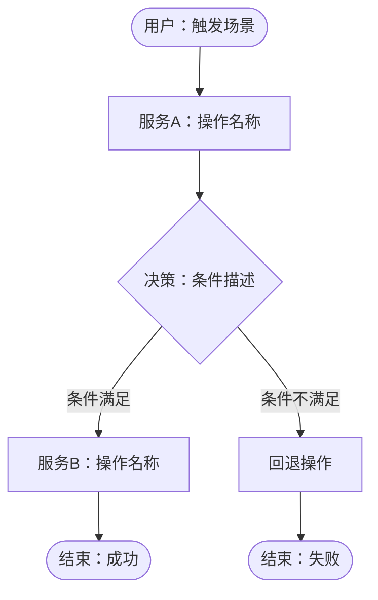

# 需求文档模板

> **路径**: `.devcodex/requirements/<中文描述>/01-需求概述.md`（唯一信源：`02-output-paths.instructions.md`）
> **触发**: dev 工作流 CP1 阶段

---

## 文档头部

> ⚠️ `入口服务` 和 `影响服务` 字段仅在**跨服务需求**（涉及 ≥2 个服务）时填写，单项目需求省略这两行。

```markdown
# [需求名称]

> **版本**: v0.0.1
> **日期**: YYYY-MM-DD
> **状态**: 草稿 / 确认 / 已实施
> **作者**: [作者]
> **入口服务**: [服务名]
> **影响服务**: [服务A（入口）· 服务B · 服务C]
```

---

## §1 背景与问题

> 描述当前问题或业务背景，说明为什么需要该功能。

## §2 目标

> 用 1~3 句话描述核心目标，格式：**[用户/系统]** 能够 **[做什么]**，从而 **[获得什么价值]**。

## §3 业务流程

> 🔴 强制：涉及多服务 / 有决策分支 / 跨轮次开发
> ⚠️ 条件：单服务简单 CRUD 整节标 N/A

### §3.1 主流程图

> 节点用 `N{编号}` 标注，与 §3.2 节点详解一一对应。



### §3.2 节点详解

> 为流程图中每个**非终止节点**（普通矩形 `[ ]` 和决策菱形 `{ }` 样式）逐一添加详解段落；终止节点（圆角矩形 `([ ])` 样式，如「结束：成功」）可省略。以下为三种典型节点结构示例：

---

#### N1 — 节点名称（所属服务 / 触发方）

**所属服务**：前端 / API 网关 / 无（用户侧）

**前置条件**：
- 进入该节点需满足的条件

**操作说明**：
该节点执行的具体动作。说明收集哪些参数、调用什么接口、执行什么校验。

**成功出口**：→ N2（说明进入下一步的条件）

**失败出口**：→ N7（返回错误码，提示内容）

**异常处理**：
- 超时（>Xs）：处理策略
- 参数非法：立即返回 4xx，不进入后续流程

---

#### N2 — 节点名称（所属服务）

**所属服务**：service-name

**前置条件**：N1 校验通过

**操作说明**：
详细描述。幂等键、副作用、异步事件等均在此说明。

**成功出口**：→ N3

**失败出口**：→ N7（回滚策略）

**异常处理**：
- 失败时的补偿或回退策略

---

#### N3 — 决策节点名称（所属服务）

**所属服务**：service-name

**判断逻辑**：
- 满足条件：条件A AND 条件B
- 不满足：任意条件为假

**条件满足 →** N4

**条件不满足 →** N5

---

## §4 功能需求

| 编号 | 需求描述 | 优先级 | 验收标准 |
|------|---------|:------:|---------|
| F-01 | | 🔴 | |
| F-02 | | 🟡 | |

## §5 非功能需求

| 类型 | 要求 |
|------|------|
| 性能 | 响应时间 ≤ Xms，并发 ≥ X |
| 安全 | |
| 可用性 | |
| 兼容性 | |

## §6 排除范围

> 明确不包含的功能，避免范围蔓延。

- 不包含：

## §7 依赖与约束

- 依赖：
- 技术约束：
- 外部依赖：

## §8 验收标准

| # | 场景 | 期望结果 |
|:-:|------|---------|
| 1 | | |

## §9 变更历史

| 版本 | 日期 | 变更说明 |
|------|------|---------|
| v1.0 | YYYY-MM-DD | 初始版本 |
