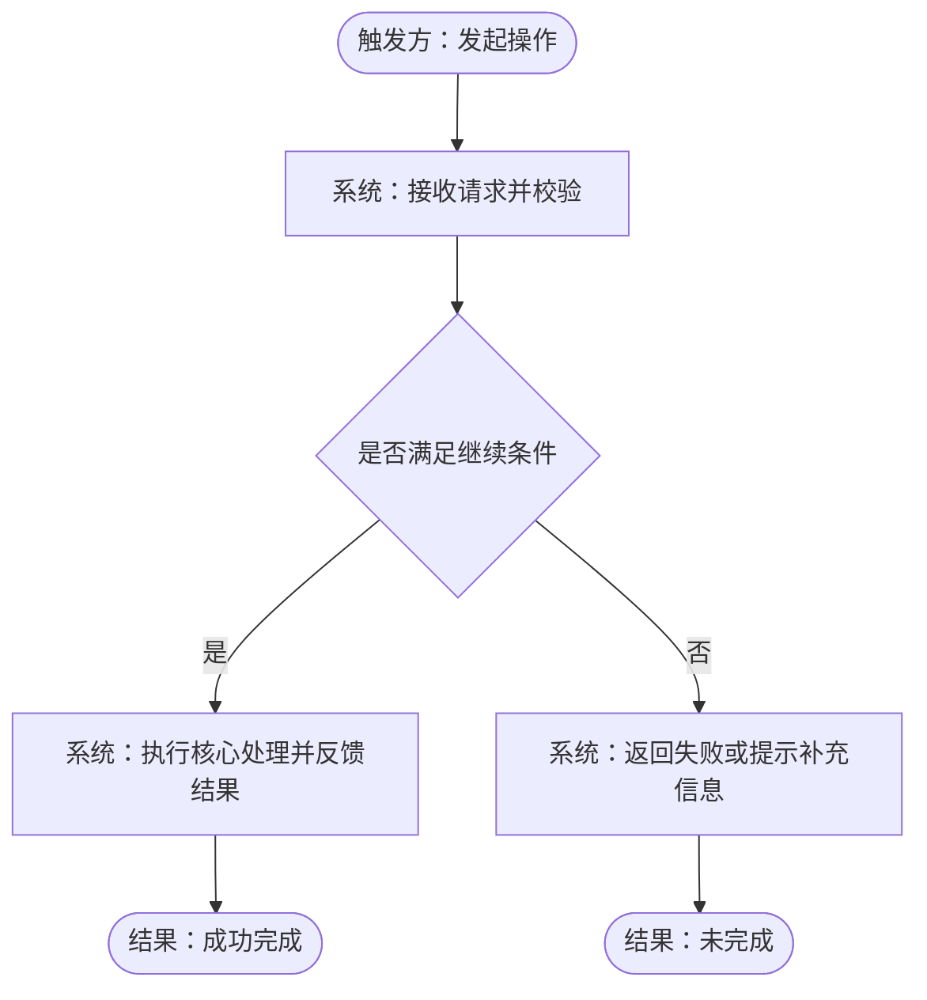

# 需求文档模板

> **路径**: `.devcodex/**/requirements/<中文描述>/01-需求概述.md`（唯一信源：`02-output-paths.instructions.md`）
> **触发**: dev 工作流 CP1 阶段

---

## 编写指引

> ⚠️ 生成的 Markdown 需求文档必须在文档头部后补 `## 目录导航`，便于长文档评审、跳转与复查。
> ⚠️ 写需求前先判断需求类型：业务/交互型需求默认展开 `§3 业务流程`；治理/迁移/控制面/规范收口类需求可将 `§3` 标为 `N/A`，但必须强化 `核心定义`、`作用域与边界判定` 与 `风险与开放问题`。
> ⚠️ 写需求和定义问题时必须前置平台工程师视角：先判断消费者范围、共享契约边界、模块职责、可维护性成本和明确非目标；“通用性/模块化”只有在真实复用者、演进边界或跨模块共享契约存在时才成立，否则保持局部最小实现。
> ⚠️ CP1 必须填写 `ImplementationComplexityPreference`：用户未要求复杂化、需求未说明或简单方案能满足验收时，默认 `simple`；若 AI 建议升级到 `balanced/robust`，先给用户 2~3 个方案、维护成本与取舍，等待确认后再升级。
> ⚠️ 描述“已接入 / 未接入”类状态时，先核验依赖与源码消费点，再拆分底座能力、当前消费者和高级能力尾项，避免把“基础已接入但高级能力未接入”误写成整体未接入。

| 类型 | 适用场景 | 默认重点 |
|------|---------|---------|
| 业务/交互型 | 用户操作、业务流转、页面交互、外部流程协作 | `§3 业务流程` + `§4 功能需求` |
| 治理/迁移/控制面型 | 规范收口、工作流调整、目录迁移、控制面改造 | `§2.1 核心定义` + `§2.2 作用域与边界判定` + `§7.1 风险与开放问题` |

---

## 文档头部

> ⚠️ `入口服务` 和 `影响服务` 字段仅在**跨服务需求**（涉及 ≥2 个服务）时填写，单项目需求省略这两行。
> ℹ️ 项目可在文档头部或正文中追加治理字段，但这些扩展位不能替代本模板的核心结构。

```markdown
# [需求名称]

> **版本**: v0.0.1
> **日期**: YYYY-MM-DD
> **状态**: 草稿 / 确认 / 已实施
> **作者**: [作者]
> **需求类型**: 业务/交互型 / 治理/迁移/控制面型
> **入口服务**: [服务名]
> **影响服务**: [服务A（入口）· 服务B · 服务C]
```

---

## 目录导航

```markdown
## 目录导航

- [§0 需求类型判定](#0-需求类型判定)
- [§1 背景与问题](#1-背景与问题)
- [§2 目标](#2-目标)
  - [§2.3 实现复杂度档位](#23-实现复杂度档位)
- [§3 业务流程](#3-业务流程)
- [§4 功能需求](#4-功能需求)
- [§5 非功能需求](#5-非功能需求)
- [§6 排除范围](#6-排除范围)
- [§7 依赖与约束](#7-依赖与约束)
- [§8 验收标准](#8-验收标准)
- [§9 当前阶段结论](#9-当前阶段结论)
- [§10 变更历史](#10-变更历史)
```

---

## §0 需求类型判定

> 先判定本需求属于“业务/交互型”还是“治理/迁移/控制面型”，并说明为什么这样归类。

## §1 背景与问题

> 描述当前问题或业务背景，说明为什么需要该功能。

## §2 目标

> 用 1~3 句话描述核心目标，优先写清：**谁触发 / 完成什么能力 / 系统给出什么可观察反馈 / 最终结果或价值是什么**。

### §2.1 核心定义

> 对治理、迁移、控制面、规范收口类需求尤为关键。先定义本需求中的核心术语、作用域对象、命名空间、状态概念或判定口径，避免 CP2/CP3 再反复补定义。

### §2.2 作用域与边界判定

> 写清本轮纳入范围、明确排除范围、默认不做的事情，以及哪些情况必须回到上一步重新确认。
> 同时用平台工程视角回答：谁会复用、哪一层值得抽象、哪一层应保持局部、长期维护成本是什么；若没有真实复用者或演进边界，不得把模块化作为默认目标。

### §2.3 实现复杂度档位（ImplementationComplexityPreference）

> 默认填写 `simple`。只有用户明确要求、更高风险边界、真实多消费者、公共契约或长期演进证据成立时，才可升级到 `balanced` 或 `robust`。

| 档位 | 默认 | 适用条件 | CP2 / CP3 传递 |
|------|:----:|----------|----------------|
| `simple` | ✅ | 简单方案可满足验收；优先局部补丁、既有模式和最少文件改动 | CP2 `§2.7` 继承并禁止无计划抽象 |
| `balanced` | 条件 | 有明确复用者、演进边界或跨模块协作，但不需要平台化 | CP2 说明新增抽象证据和维护成本 |
| `robust` | 条件 | 用户明确要求或已有公共契约、多消费者、高风险长期演进 | CP2 必须列备选方案、成本与确认依据 |

**当前选择**：`simple` / `balanced` / `robust`

**选择理由**：

**若升级复杂度，需用户确认的方案选项**：

## §3 业务流程

> 🔴 默认应填写：除纯静态文案、纯说明补充一类无需行为流转的改动外，都应描述业务流程。
> ⚠️ 本节优先使用“触发方动作 / 系统可观察反馈 / 状态变化 / 业务结果”语义；不要默认用服务名、接口名、模块名作为主视角。
> ⚠️ 若需求属于治理/迁移/控制面型且没有合适的行为流转，整节可标 `N/A`，但需补强 `§2.1`、`§2.2` 与 `§7.1`。

### §3.1 主流程图

> 节点用 `N{编号}` 标注，与 §3.2 节点详解一一对应。



### §3.2 节点详解

> 为流程图中每个**非终止节点**（普通矩形 `[ ]` 和决策菱形 `{ }` 样式）逐一添加详解段落；终止节点（圆角矩形 `([ ])` 样式，如「结束：成功」）可省略。以下为三种典型节点结构示例：

---

#### N1 — 节点名称（触发方 / 所属角色）

**触发方 / 所属角色**：用户 / 外部系统 / 定时任务 / API 调用方

**前置条件**：
- 进入该节点需满足的条件

**操作说明**：
该节点执行的具体动作。说明触发方做了什么、系统接收到什么信息、后续要产生什么可观察反馈。

**成功出口**：→ N2（说明进入下一步的条件）

**失败出口**：→ N7（返回错误码，提示内容）

**异常处理**：
- 超时（>Xs）：处理策略
- 参数非法：立即返回 4xx，不进入后续流程

---

#### N2 — 节点名称（系统处理节点）

**所属角色**：系统 / 后台任务 / 处理节点

**前置条件**：N1 校验通过

**操作说明**：
详细描述。重点说明系统做了什么、状态发生了什么变化、用户或调用方能看到什么反馈；只有在确有必要时才补充接口或模块名。

**成功出口**：→ N3

**失败出口**：→ N7（回滚策略）

**异常处理**：
- 失败时的补偿或回退策略

---

#### N3 — 决策节点名称（判断节点）

**所属角色**：系统判断节点

**判断逻辑**：
- 满足条件：条件A AND 条件B
- 不满足：任意条件为假

**条件满足 →** N4

**条件不满足 →** N5

---

## §4 功能需求

> ℹ️ **优先级三档**：🔴 必须（核心路径，无此功能需求即不成立）/ 🟡 应有（提升完整度，可延后一期）/ 💡 增强（锦上添花，可独立交付）。判断维度：业务价值 × 技术依赖度 × 交付风险。
> ⚠️ 本节只描述最终能力、交互结果和业务约束，不写实现步骤、模块拆分、技术选型或接口字段细节。

| 编号 | 需求描述 | 优先级 | 验收标准 |
|------|---------|:------:|---------|
| F-01 | | 🔴 | |
| F-02 | | 🟡 | |

## §5 非功能需求

| 类型 | 要求 |
|------|------|
| 性能 | 响应时间 ≤ Xms，并发 ≥ X |
| 安全 | |
| 可用性 | |
| 兼容性 | |

## §6 排除范围

> 明确不包含的功能，避免范围蔓延。

- 不包含：

## §7 依赖与约束

- 依赖：
- 技术约束：
- 外部依赖：

### §7.1 风险与开放问题

> 记录当前阶段已经识别到的主要风险、未决问题和需要用户在后续阶段继续确认的开放点。

## §8 验收标准

> ℹ️ **格式要求**：每行为一条可独立执行的验证用例；每个功能需求（F-XX）至少须有一条负向场景（类型标 `负向`），覆盖：参数非法 / 权限不足 / 资源不存在 / 边界值溢出 中至少一种。

| # | 类型 | 前置条件 | 操作 | 期望结果 |
|:-:|:----:|---------|------|---------|
| 1 | 正向 | | | |
| 2 | 负向 | | | |

## §9 当前阶段结论

> 用 2~5 句话总结：当前边界是否已经收敛、是否可进入 CP2、仍有哪些待后续阶段继续验证的重点。

## §10 变更历史

| 版本 | 日期 | 变更说明 |
|------|------|---------|
| v1.0 | YYYY-MM-DD | 初始版本 |
