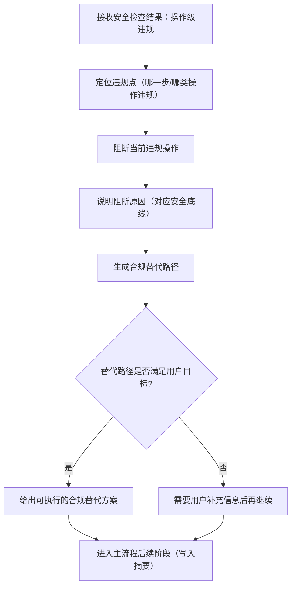

# ② 阻断并给出合规替代流程图

> 本页聚焦主流程中“操作级违规”分支：`阻断该操作并给出合规替代`。  
> 当前仍为流程定义阶段，下面是 v1.0.0 的流程骨架，不代表已实现代码。

---

## 操作级违规处理主链

---

## 阶段输出要求

1. 明确“被阻断的具体操作”与阻断依据
2. 明确“可继续执行的合规替代路径”
3. 在不突破安全底线的前提下，尽量保持用户目标可达

---

## 与主流程关系

- 主流程入口见：[主流程图](/specs/flowcharts)
- 上游判定节点见：[安全检查流程图](/specs/safety-check-flow)

> 约束：该分支只处理“操作级违规”，不处理“致命违规终止”。
