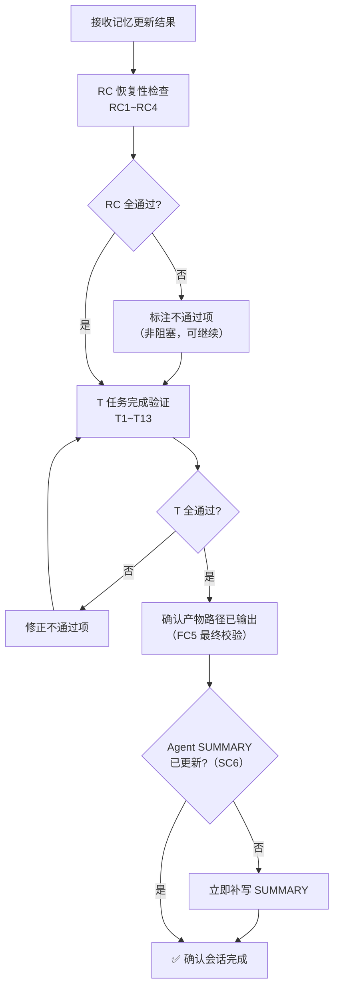

# ⑫ 完成前合规检查流程图

> 本页聚焦主流程中的 `⑫ 完成前合规检查` 阶段。  
> 该阶段在更新记忆之后、确认会话完成之前执行，确保收尾闭环。

---

## 完成前合规检查主链

---

## RC 恢复性检查（非阻塞）

> **豁免**：chat 豁免全部合规检查；analyze 豁免 RC 层。

| # | 检查项 |
|:-:|--------|
| RC1 | 记忆文件是否足以让下一个 Agent 恢复上下文 |
| RC2 | 已产出文件是否自洽完整 |
| RC3 | 🔄 标记任务是否提供了足够恢复线索 |
| RC4 | 关联需求的 `.memory/sessions.md` 是否已创建 |

## T 任务完成验证

| alias | canonical ID | 检查项 |
|:---:|---|---|
| T1 | `requirements.coverage` | ✅ 需求覆盖（用户所有需求点已处理） |
| T2 | `delivery.report` | ✅ 报告存在（chat 豁免） |
| T3 | `delivery.memory` | ✅ 记忆完整（任务摘要+对话记录+关联报告） |
| T4 | `confirmation.cp` | ✅ CP 完整（dev/fix） |
| T5 | `governance.compliance` | ✅ 合规通过（FC+SC 全通过） |
| T6 | `constraints.and-sync` | ✅ 约束遵守（C01~C22 + 关联文件已同步） |
| T7 | `workflow.verification` | ✅ 工作流验证（dev/fix 含适用门禁与 ECR） |
| T8 | `continuity.summary` | ✅ SUMMARY/continuation 已更新 |
| T9 | `delivery.manifest` | ✅ internal manifest 与用户可见交付已完成 |
| T10 | `long-task.timing-and-coverage` | ✅ 条件：长任务 timing 与确认类 coverage/residual |
| T11 | `long-task.budget-and-authorization` | ✅ 条件：预算、授权与 external wait |
| T12 | `deployment.and-completion-evidence` | ✅ 条件：工作区同步与完成证据 |
| T13 | `post-delivery.self-check` | ✅ 条件：交付后自检 |

T1~T13 是兼容 alias；运行时状态、receipt 和聚合使用 canonical ID。

---

## 阶段输出要求

1. RC 不通过项为非阻塞 — 标注后可继续完成
2. T 不通过项为阻塞 — 必须修正后重检
3. 所有检查通过后确认会话完成
4. chat 工作流走简化路径（豁免报告和 RC，仅验证记忆写入）

---

## 与主流程关系

- 主流程入口见：[主流程图](/specs/flowcharts)
- 合规框架入口见：[合规检查框架](/specs/compliance-framework)
- 上游阶段见：[⑪ 更新记忆流程图](/specs/memory-update-flow)
- 下游：确认会话完成 → END

> 约束：完成前合规检查为主链最后一道闸门，不可跳过。
