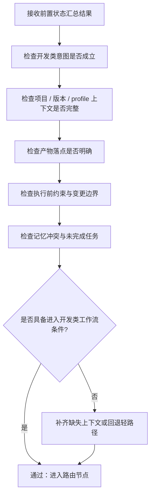

# 开发阶段合规检查流程图

> 本页聚焦主流程中的 `⑥ 开发阶段合规检查` 阶段。  
> 当前仍为流程定义阶段，下面是 v1.0.0 的开发前合规检查骨架，不代表已实现代码。

---

## 开发阶段合规检查主链

---

## 阶段输出要求

1. 给出“可路由 / 不可直接路由”的明确结论
2. 不可路由时，给出需要补齐的最小条件集
3. 保证进入路由前的项目上下文、边界和约束已清晰

---

## 与主流程关系

- 主流程入口见：[主流程图](/specs/flowcharts)
- 合规框架入口见：[合规检查框架](/specs/compliance-framework)
- 上游阶段见：[前置状态汇总流程图](/specs/pre-state-summary-flow)

> 约束：该节点属于开发前闸门，位置在“前置状态汇总之后、路由之前”。
