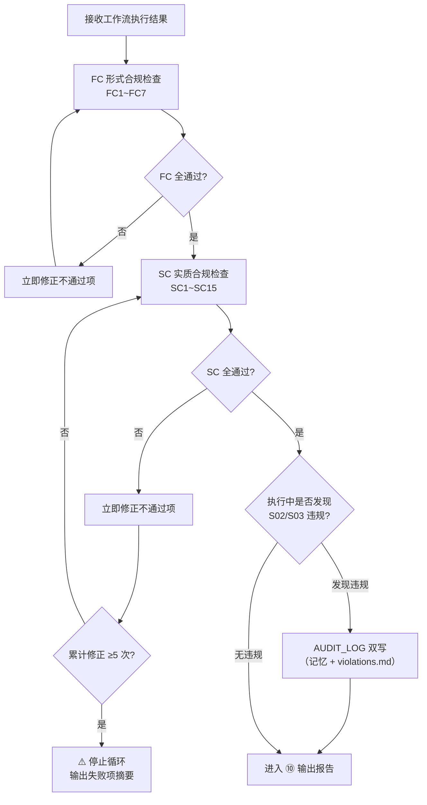

# ⑨ 执行阶段合规检查流程图

> 本页聚焦主流程中的 `⑨ 执行阶段合规检查` 阶段。  
> 该阶段检查工作流执行过程本身是否合规，位于工作流执行之后、输出报告之前。

---

## 执行阶段合规检查主链

---

## FC 形式合规检查项

| # | 检查项 | 说明 |
|:-:|--------|------|
| FC1 | 记忆文件完整 | 必填字段齐全，📨 四列表格格式 |
| FC2 | 报告文件已写入 | chat 豁免 |
| FC3 | CP 按序执行 | dev/fix 强制 |
| FC4 | 文件名/路径合规 | `NN--` 双横杠 |
| FC5 | 产物路径已输出 | `📂 本次会话产物` 区块内的相对路径 Markdown 链接 |
| FC6 | 新建 .md 行数 | ≤ 500 行 |
| FC7 | 决策推荐项 | 用户决策节点和报告决策点必须有推荐项和推荐理由；无后续动作时写“推荐：无后续动作” |

## SC 实质合规检查项（关键）

| # | 检查项 | 适用范围 |
|:-:|--------|---------|
| SC2 | 代码已诊断 | dev/fix 🔴 |
| SC3 | 修复已全局扫描（三步） | fix 🔴 |
| SC4 | 关联文件已同步 | dev/fix/self-fix 🔴 |
| SC6 | Agent SUMMARY 已更新 | 全工作流 🔴 |
| SC5 | 后续建议与推荐结论 | 多建议/多路径报告必须有推荐结论 |
| SC15 | ECR 执行闭环复审 | dev/fix 🔴，覆盖 CP、报告、记忆、SUMMARY、diff/commit、测试/探针与 dirty 边界 |

---

## 阶段输出要求

1. FC 不通过 → 立即修正后重检
2. SC 🔴 阻塞性项不通过 → 修正后重检
3. 累计修正 ≥5 次仍未全通过 → 停止循环，输出摘要标 ⚠️，写入记忆后交由用户决策
4. 发现 S02/S03 违规 → AUDIT_LOG 双写（被动触发位置）

---

## 与主流程关系

- 主流程入口见：[主流程图](/specs/flowcharts)
- 合规框架入口见：[合规检查框架](/specs/compliance-framework)
- 上游阶段见：[⑧ 工作流执行流程图](/specs/workflow-execution-flow)
- 下游阶段见：[⑩ 输出报告流程图](/specs/report-output-flow)

> 约束：执行阶段合规检查为主链必经阶段（chat 豁免），不可跳过。
