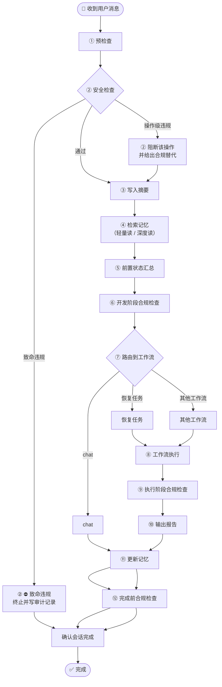

# DevCodex 主流程图

> 本页只保留 **长期稳定的主流程骨架**。  
> v1.0.0 的版本化执行要求见 [P0：执行流程骨架](/versions/v1/1.0.0/requirements/p0/execution-flow)。

---

## 主流程

每次收到用户消息后，Agent 按以下稳定主流程执行：

> **说明**：下图所有主节点都是**必须经过**的正式阶段。  
> 图中的差异只表示**顺序**与**分支关系**，不表示“可选”或“可跳过”。

### 预检查包含的固定内容

`① 预检查` 不是单一步骤，而是必须完整执行的前置阶段，包含：

1. **PC0** — 读取核心规则 / 安全底线 / 通用规范 + 确认 profile 加载状态 + 确认输出语言
2. **PC1** — 识别意图（工作流.子类型）
3. **PC2** — 检查会话状态（轮次 / 待跟进事项）
4. **PC3** — 确定产物落点（报告/记忆/需求目录）+ 检查未完成任务
5. **PC4** — 规范原因识别（**仅 dev 模式**）：判断当前问题是否源于规范缺失/模糊，标记 PF 或 VL 待延迟追加
6. **PC5** — 部署体状态：检查父链 `.github/`、`.claude/`、`AGENTS.md`、`.agents/`、`.codex/` 与源仓库关键文件是否同步
7. **PC6** — 工作区一致性：检查 git dirty 状态与当前需求目录上下文
8. **PC7** — 新会话 resume 检测：读取 tasks 文件并比对 SUMMARY，防止截断后误开新任务

预检查阶段细图见：[① 预检查流程图](/specs/precheck-flow)。

### 安全检查包含的固定内容

`② 安全检查` 是预检查之后、摘要之前的强制闸门，包含：

1. 基于当前规则基线判断是否违规
2. 操作级违规时阻断当前操作并给出合规替代
3. 致命违规时阻断并写入审计记录
4. 根据判定结果决定继续执行或终止

安全检查阶段细图见：[② 安全检查流程图](/specs/safety-check-flow)。
操作级违规分支细图见：[② 阻断并给出合规替代流程图](/specs/block-op-flow)。

### 写入摘要包含的固定内容

`③ 写入摘要` 是安全检查之后、记忆检索之前的主链节点，包含：

1. 提取本轮任务目标、约束与边界
2. 形成可用于后续记忆检索的摘要表达
3. 对摘要质量做最小自检（是否可支撑后续检索）
4. 摘要可用后再进入记忆阶段

写入摘要阶段细图见：[③ 写入摘要流程图](/specs/summary-flow)。

### 检索记忆包含的固定内容

`④ 检索记忆` 是摘要之后、开发阶段合规检查之前的主链节点，包含：

1. 按意图确定记忆检索深度（轻量读 / 深度读）
2. 检索并合并与当前任务相关的历史上下文
3. 识别记忆冲突或未完成任务状态
4. 输出可供下一节点判定的记忆状态

检索记忆阶段细图见：[④ 检索记忆流程图](/specs/memory-retrieval-flow)。

### 前置状态汇总包含的固定内容

`⑤ 前置状态汇总` 是记忆检索之后、开发阶段合规检查之前的主链节点，包含：

1. 汇总前置阶段的有效状态信息
2. 统一表达当前可执行状态与待补齐状态
3. 为开发阶段合规检查提供完整输入视图

前置状态汇总细图见：[⑤ 前置状态汇总流程图](/specs/pre-state-summary-flow)。

### 开发阶段合规检查包含的固定内容

`⑥ 开发阶段合规检查` 是进入工作流前的前置闸门，用于确认“当前请求是否已经具备进入开发类流程的条件”。

建议至少检查以下内容：

1. **开发类意图是否成立**：当前请求到底是 `chat`、`恢复任务`，还是 `dev / fix / audit / self-fix / plan`
2. **profile 与项目上下文是否足够**：是否已经定位到正确项目、正确版本、正确规范边界
3. **产物落点是否明确**：报告、记忆、需求文档、实现产物是否有确定归档位置
4. **记忆状态是否冲突**：是否存在未完成任务、是否应优先进入“恢复任务”
5. **执行前约束是否齐备**：当前任务需要的工具、目录、运行条件、权限边界是否满足
6. **变更边界是否清晰**：是只读分析、文档调整，还是允许进入真实开发修改

如果这些条件未满足，就不应直接进入开发类工作流，而应先补齐上下文或回退到更轻的处理路径。

开发阶段合规检查细图见：[⑥ 开发阶段合规检查流程图](/specs/dev-compliance-flow)。

### 路由到工作流包含的固定内容

`⑦ 路由到工作流` 是开发阶段合规检查之后的分流节点，负责将意图路由到对应工作流：

1. **chat 快速路径**：三问法全指向分析 + 无文件变更 → 跳过 CP 和报告，仅写记忆
2. **resume 恢复路径**：读取记忆 → 还原上下文 → 提取原始意图 → 重路由
3. **违规质疑路由**：用户质疑规范违反 → 强制路由到 audit
4. **标准工作流**：dev / fix / audit / analyze / self-fix / plan → 子类型路由后进入执行
5. **多意图处理**：≥2 意图 → 按序逐一路由，独立走完整工作流周期

路由到工作流细图见：[⑦ 路由到工作流流程图](/specs/routing-flow)。

### 工作流执行包含的固定内容

`⑧ 工作流执行` 是路由完成后的核心执行阶段，按工作流类型执行不同流程：

1. **dev**：CP1→CP2→plan-review→impact-review→CP3→执行→api-verification→document-sync→ECR 执行闭环复审
2. **fix**：诊断三步→CP1→CP2→执行→三步扫描→CP3（条件触发）→ECR 执行闭环复审
3. **audit**：多轮收敛，连续 3 轮零发现（所有子类型统一，不区分定向/全面），所有 🔴 已解决
4. **analyze**：多轮只读分析，≥3 轮，连续 2 轮无新发现后收敛
5. **self-fix**：分级（自动/Pending/拒绝）后修复规范文件
6. **plan**：拆解目标→执行计划→用户确认→逐步执行

工作流执行细图见：[⑧ 工作流执行流程图](/specs/workflow-execution-flow)。

### 执行阶段合规检查包含的固定内容

`⑨ 执行阶段合规检查` 用于检查**开发执行过程本身**是否合规，重点不是看收尾产物，而是看执行链是否完整。

建议至少检查以下内容：

1. 是否按对应 workflow 要求完成必要执行步骤
2. 是否遗漏必要扫描、验证或阶段性检查
3. 是否违反开发工作流内的操作约束
4. 是否存在可恢复失败、未处理异常或中断状态

执行阶段合规检查细图见：[⑨ 执行阶段合规检查流程图](/specs/exec-compliance-flow)。

### 输出报告包含的固定内容

`⑩ 输出报告` 是执行阶段合规检查通过后的产物输出阶段，包含：

1. 按工作流类型选择报告模板
2. 确定报告路径（需求级优先，项目级兜底）
3. 填写头部必填项 + 正文（每条附五项验证，多路径含推荐结论）
4. 执行报告二次验证（V1~V6）
5. 回复末尾输出产物路径

输出报告细图见：[⑩ 输出报告流程图](/specs/report-output-flow)。

### 更新记忆包含的固定内容

`⑪ 更新记忆` 是报告输出后的记忆持久化阶段，包含：

1. 追加/更新 Agent 日记（每会话必写）
2. 更新 Agent SUMMARY（每会话追加索引行）
3. 按需更新需求级记忆
4. 按需更新全局 SUMMARY（仅关键决策）
5. Token 防护检查（>13 轮写编码检查点）

更新记忆细图见：[⑪ 更新记忆流程图](/specs/memory-update-flow)。

### 完成前合规检查包含的固定内容

`⑫ 完成前合规检查` 放在 `更新记忆` 之后、`确认会话完成` 之前，用于检查**收尾闭环是否真正完成**。

建议至少检查以下内容：

1. 报告是否已输出
2. 记忆是否已更新
3. 审计记录或必要痕迹是否已落盘
4. 会话状态是否已闭环，是否具备"确认完成"的条件

完成前合规检查细图见：[⑫ 完成前合规检查流程图](/specs/completion-compliance-flow)。

---

## 为什么主流程要这样设计

这条主流程不是为了把所有执行细节都画出来，而是为了保留 **不会轻易变化的稳定骨架**。

设计原理如下：

### 1. 先建立规则与上下文，再开始判断任务

主流程先进入预检查，而不是直接路由到工作流，原因是 DevCodex 不是普通问答系统，而是一个会生成报告、记忆与规范产物的执行体系。  
因此在真正执行前，必须先明确：

- 当前规则基线是什么
- 当前安全底线是什么
- 当前项目上下文是什么
- 当前产物应该落到哪里

只有这些前置条件明确后，后续的安全判断、摘要写入、记忆检索和路由才有稳定基础。

### 2. 安全检查必须在摘要和记忆之前

安全检查的作用，是在进入正式执行前判断当前请求是否触碰安全底线。

- 如果请求合法，继续执行
- 如果只是操作级违规，阻断该操作并以合规方式继续
- 如果是致命违规，立即终止

之所以放在摘要与记忆之前，是为了避免违规请求继续扩散到后续节点。

### 3. 先写摘要，再读记忆

摘要是把“这次请求要做什么”压缩成稳定表示。  
先形成摘要，再去读取记忆，系统才能更清楚地判断：

- 要找哪类历史上下文
- 是轻量补充还是深度恢复
- 是否可能进入“恢复任务”路径

### 4. 记忆检索不是单一动作，而是分级读取

记忆节点保留在主流程里，但不强制所有意图都做相同深度的读取。

- `chat` 可只做轻量读
- `恢复任务`、`dev`、`fix`、`audit` 等可做深度读

这样既保留统一主流程，也兼容不同工作流对上下文深度的不同需求。

### 5. 前置状态汇总先于开发闸门

把“前置状态汇总”外提为独立主节点后，开发前闸门不再直接消费零散输入，而是消费一个结构化状态视图。  
这能减少“节点间重复判断”和“状态遗漏”问题。

### 6. 开发阶段合规检查要放在路由之前

只做安全检查还不够。  
安全检查解决的是“能不能做”，开发阶段合规检查解决的是“现在是否具备进入开发工作流的条件”。

它和后面的两类合规检查不是一回事：

- **开发阶段合规检查**：路由前执行，判断开发前提是否齐备
- **执行阶段合规检查**：执行后执行，检查开发过程本身是否合规
- **完成前合规检查**：收尾产物生成后执行，检查会话是否真的可以结束

如果缺少这一步，系统可能会在项目、版本、落点、记忆状态都还不清楚时，过早进入开发类工作流。

### 7. 路由至少区分 chat / 恢复任务 / 其他工作流

这三个分支在 DevCodex 中语义不同：

- `chat`：轻路径，直接答复，豁免报告
- `恢复任务`：恢复路径，需要结合历史上下文继续原任务
- 其他工作流：进入标准执行链

因此主图必须体现三者差异，不能简单画成单一“工作流”出口。

### 8. 执行后与完成前需要分成两次合规检查

如果只保留一个“收尾合规检查”，就会把两类问题混在一起：

- 一类是“执行过程是否合规”
- 一类是“报告、记忆、审计是否都已完成”

因此更合理的结构是：

- **执行阶段合规检查**：位于 `工作流执行` 之后
- **完成前合规检查**：位于 `更新记忆` 之后、`确认会话完成` 之前

这样能保证：

- 执行过程完整
- 必要产物没有遗漏
- 收尾行为统一可审计

### 9. 术语与实现命名需要分层

为避免“中文流程图”和“英文实现标识”混淆，建议固定规则：

- 流程图与需求文案：使用中文业务术语（如“恢复任务”）
- Skill / 目录 / 标识符：使用英文 kebab-case（如 `resume`）

---

## 术语映射（流程图 ↔ 实现）

| 流程术语 | 实现标识（建议） |
|---------|----------------|
| 恢复任务 | `resume` |
| 前置状态汇总 | `pre-state-summary` |
| 开发阶段合规检查 | `dev-compliance` |
| 执行阶段合规检查 | `execution-compliance` |
| 完成前合规检查 | `completion-compliance` |

---

## 为什么这里只保留主流程

- `/specs/` 只承载**稳定概念**，避免把 v1.0.0 的实现细节误写成永久规范。
- dev / fix / audit / 恢复任务 / compliance 等细节流程仍属于**版本需求**，后续可能迭代。
- 当前未冻结的子流程不在此页展开，避免过早固化。
- 合规缩写与定义以 [合规检查框架](/specs/compliance-framework) 为准。

---

## 当前冻结的稳定决策

| 决策点 | 规则 |
|--------|------|
| 预检查优先 | 主流程先建立规则、上下文与产物落点，再进入正式判断 |
| 安全检查位置 | 安全检查发生在预检查之后、摘要之前 |
| 摘要与记忆顺序 | 先写摘要，再按意图检索记忆 |
| 记忆读取策略 | 记忆允许按意图做轻量读或深度读 |
| 前置状态汇总 | 记忆之后先做前置状态汇总，再进入开发前置闸门 |
| 开发前置闸门 | 前置状态汇总之后、路由之前必须执行开发阶段合规检查 |
| 路由分层 | 至少区分 chat / 恢复任务 / 其他工作流 |
| chat 收尾规则 | chat 工作流豁免报告，但仍必须写记忆 |
| 执行合规位置 | 普通工作流执行后必须先过执行阶段合规检查 |
| 完成前合规位置 | 报告与记忆写入后，必须再做完成前合规检查才能确认结束 |
| 版本化详细流程 | 详细执行要求进入对应版本的 P0/P1/P2 需求文档 |

---

## 还需要补充哪些开发节点检查

除了已经加入的 `⑥ 开发阶段合规检查`，当前主流程里还建议继续强化以下开发相关检查点：

| 节点 | 建议补充的开发检查 |
|------|------------------|
| 预检查 | 项目是否识别正确、版本是否识别正确、profile 是否加载完整 |
| 记忆检索 | 是否存在未完成开发任务、是否应先进入“恢复任务” |
| 前置状态汇总 | 前置阶段状态是否完整、是否存在未标注的不确定项 |
| 开发阶段合规检查 | 任务类型、落点、执行前约束、变更边界、是否允许真实修改 |
| 路由 | `chat` 与开发类工作流是否被误分流 |
| 工作流执行 | 开发类工作流内部仍需各自执行节点级自检 |
| 执行阶段合规检查 | workflow 执行链是否完整、必要扫描/校验是否已执行 |
| 完成前合规检查 | 是否完成报告、记忆写入、状态闭环与必要审计 |

---

## 后续补充原则

本页定义的是主流程骨架。后续会按节点逐步补充对应规范，原则如下：

1. **主图只保留稳定节点**
2. **每个节点的详细规则逐步下沉到对应 skill / workflow 规范**
3. **节点级 skill 规范补齐后，主图只负责表达顺序与关系，不重复细则**

当前计划中的节点级承接方向包括：

| 主流程节点 | 后续承接方向 |
|-----------|-------------|
| 预检查 | 输出规则 / profile / precheck status 相关 skill 规范 |
| 安全检查 | safety / block / 审计相关规范 |
| 摘要 | summary skill 规范 |
| 记忆 | memory skill 规范 |
| 前置状态汇总 | pre-state-summary / pre-route-state 相关规范 |
| 开发阶段合规检查 | dev-compliance / pre-route validation 相关规范 |
| 路由 | intent / routing / 恢复任务 相关规范 |
| 工作流执行 | 对应 workflow / skill 规范 |
| 执行阶段合规检查 | compliance / workflow-validation skill 规范 |
| 完成前合规检查 | completion-compliance / closeout-validation 相关规范 |
| 报告 / 记忆写入 | report / memory skill 规范 |
