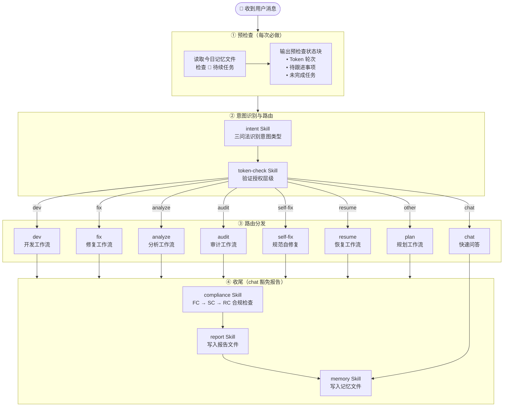
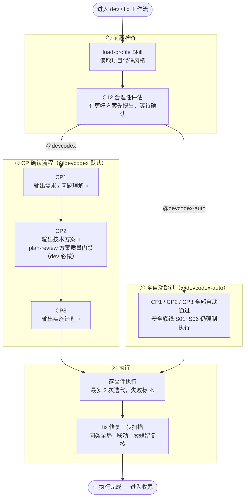
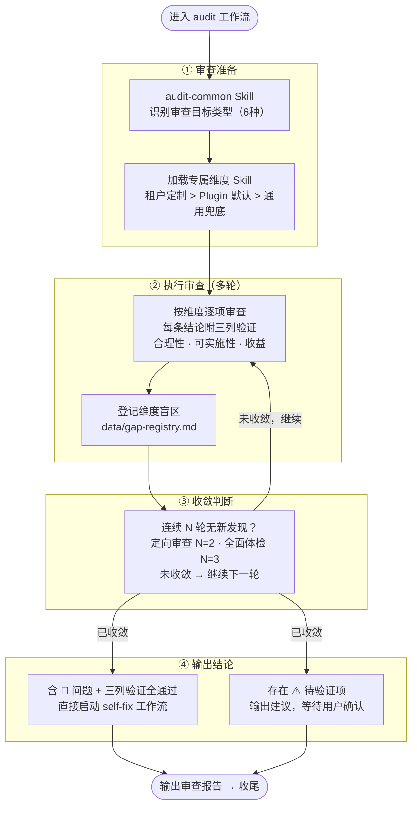
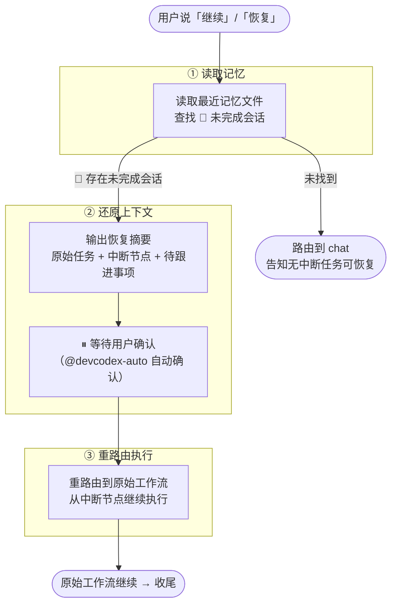
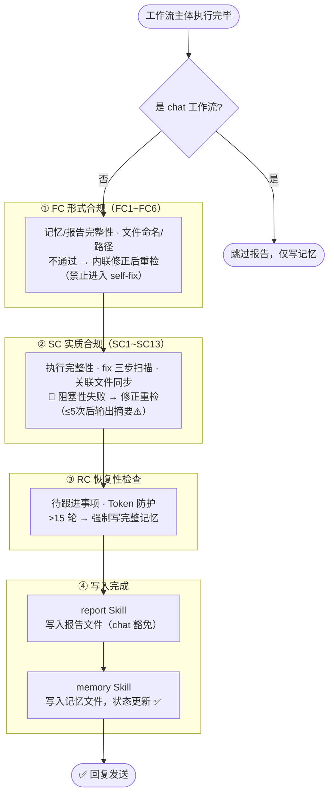

# DevCodex 执行流程图

> 本页面展示 DevCodex Agent 的完整执行流程，作为 v1.0.0 实施的标准参考。

---

## 图一：主流程

每次收到用户消息后，Agent 必须按此流程执行：

---

## 图二：dev / fix 工作流（CP 流程 + 双 Agent 模式）

---

## 图三：audit 工作流（多轮收敛）

---

## 图四：resume 工作流

---

## 图五：合规检查流程（每次收尾执行）

---

## 关键决策说明

| 决策点 | 规则 |
|--------|------|
| 全自动模式切换 | 选择 `@devcodex-auto` Agent 进入全自动模式，会话级生效 |
| 安全底线不可跳过 | 任何模式下 S01~S06/C01/C10 强制触发，全自动也不例外 |
| 全自动失败处理 | 自动重试 ≤2 次；仍失败则停止标 ⚠️ |
| audit 收敛阈值 | 定向审查=2轮无新发现；全面体检=3轮无新发现 |
| plan-review 阻断 | 回 CP2 重确认方案，不直接终止任务 |
| chat 豁免 | chat 豁免报告写入，但记忆必须写入 |
