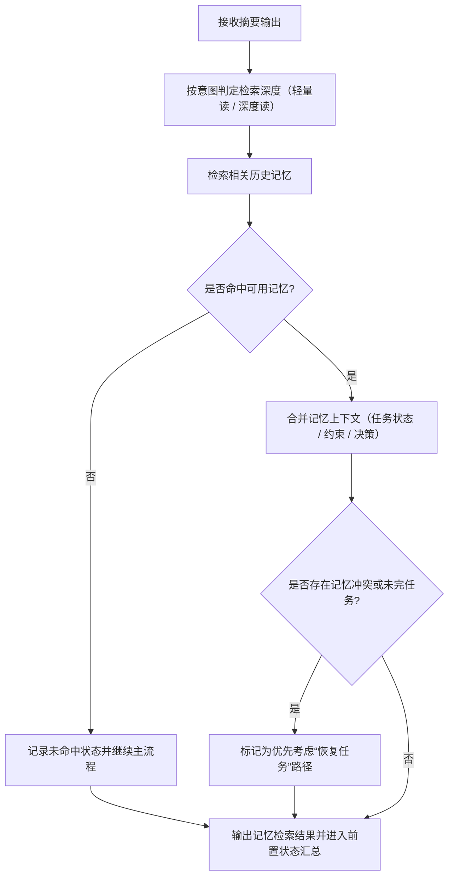

# ④ 检索记忆流程图

> 本页聚焦主流程中的 `④ 检索记忆` 阶段。  
> 当前仍为流程定义阶段，下面是 v1.0.0 的记忆检索骨架，不代表已实现代码。

---

## 记忆检索主链

---

## 阶段输出要求

1. 明确检索深度与检索范围
2. 明确“命中 / 未命中 / 冲突”状态
3. 输出可直接用于下一节点判断的记忆状态摘要

---

## 与主流程关系

- 主流程入口见：[主流程图](/specs/flowcharts)
- 上游阶段见：[写入摘要流程图](/specs/summary-flow)
- 下游阶段见：[前置状态汇总流程图](/specs/pre-state-summary-flow)

> 约束：记忆检索为主链必经阶段，不可跳过。
