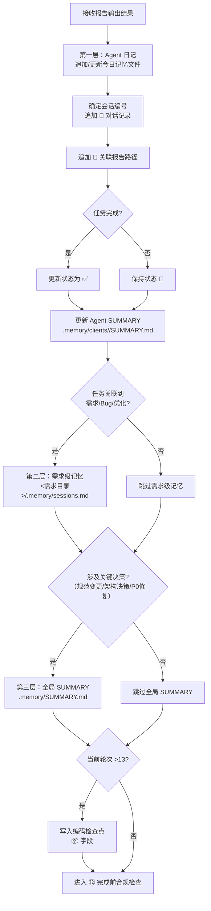

# ⑪ 更新记忆流程图

> 本页聚焦主流程中的 `⑪ 更新记忆` 阶段。  
> 该阶段在报告输出后执行，负责更新三层记忆体系，确保会话上下文可恢复。

---

## 更新记忆主链



---

## 三层记忆体系

| 层级 | 路径 | 触发条件 |
|------|------|---------|
| **① Agent 日记** | `.memory/clients/<agent>/tasks/YYYYMMDD.md` | 每会话必写 |
| **② 需求级记忆** | `<需求目录>/.memory/sessions.md` | 路由确定后追加 |
| **③ 全局 SUMMARY** | `.memory/SUMMARY.md` | 仅关键决策时 |

## Agent SUMMARY 格式

```markdown
| 日期 | 会话 | 类型 | 摘要 | 关联报告 | 关联记忆 | 状态 |
```

---

## 写入约束

- ⛔ 禁止询问用户"是否需要写入记忆"（C05/S05 — 强制自动写入）
- ⛔ 禁止覆盖已有内容（C06/S04 — 只能追加，增量编辑）
- ⛔ 禁止使用终端命令修改 .md 文件（C09）
- ⛔ 禁止使用 glob/find 扫描 `.memory/`

---

## 与主流程关系

- 主流程入口见：[主流程图](/specs/flowcharts)
- 上游阶段见：[⑩ 输出报告流程图](/specs/report-output-flow)
- 下游阶段见：[⑫ 完成前合规检查流程图](/specs/completion-compliance-flow)
- 记忆规范见：`skills/memory/SKILL.md`

> 约束：更新记忆为主链必经阶段（chat 仍须写记忆），不可跳过。

