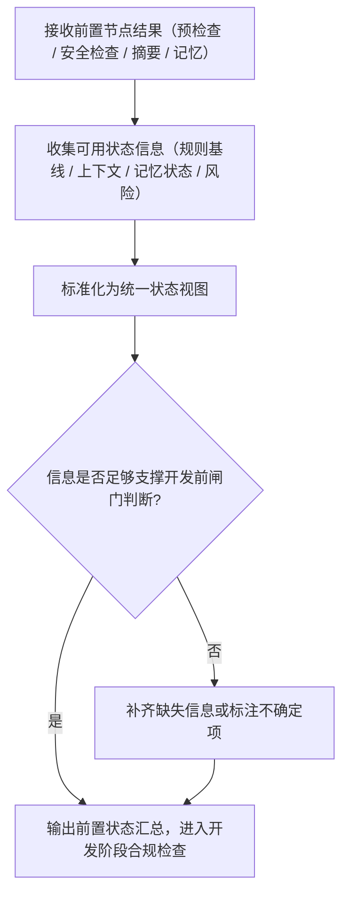

# ⑤ 前置状态汇总流程图

> 本页聚焦主流程中的 `⑤ 前置状态汇总` 阶段。  
> 当前仍为流程定义阶段，下面是 v1.0.0 的前置状态汇总骨架，不代表已实现代码。

---

## 前置状态汇总主链

---

## 阶段输出要求

1. 汇总必须覆盖：规则基线、上下文完整度、记忆状态
2. 明确标注“已确定 / 待补齐 / 有冲突”的状态项
3. 输出结果可直接供开发阶段合规检查使用

---

## 与主流程关系

- 主流程入口见：[主流程图](/specs/flowcharts)
- 上游阶段见：[检索记忆流程图](/specs/memory-retrieval-flow)
- 下游阶段见：[开发阶段合规检查流程图](/specs/dev-compliance-flow)

> 约束：该节点是开发前置闸门前的统一状态收敛节点，不可跳过。
