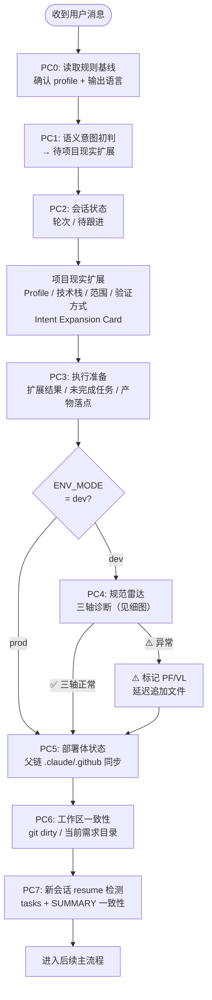
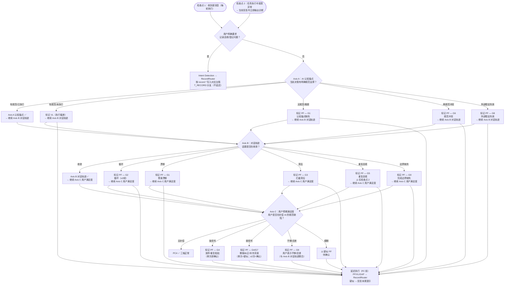

# ① 预检查流程图

> 本页聚焦主流程中的 `① 预检查` 阶段。  
> 入口检查是每次收到消息后必须经过的前置闸门；所有模式输出 PC0~PC7，dev 模式额外执行 PC4 完整规范雷达与后置合规链。

---

## 预检查主链

> ℹ️ **检查点 2（任务执行中）**：若任务执行中任意 Axis 检测到异常，在当前回复中立即完成 PC4 诊断并输出，不等待下轮消息。  
> PC4 内部决策细节见下方细图及专属页面；完整规范见 `18-spec-radar.instructions.md`。

---

## 入口检查阶段输出

预检查阶段结束时，至少应产出以下基础信息：

1. **PC0** — 当前会话适用的规则基线 + profile 加载状态 + 输出语言
2. **PC1** — 语义初判与项目现实扩展后的最终路由
3. **PC2** — 会话状态（轮次 / 待跟进）
4. **PC3** — 执行准备状态（项目现实扩展结果 / 未完成任务 / 产物落点）
5. **PC4** — 规范原因识别结果：dev 模式输出 ✅ 无 / ⚠️ PF 标记 / VL 标记；非 dev 模式标注 N/A
6. **PC5** — 部署体状态：父链 `.claude/.github/` 是否存在、是否与源仓库关键文件同步
7. **PC6** — 工作区一致性：git 未提交变更、当前需求目录或任务上下文
8. **PC7** — 新会话 resume 强制检测：今日/昨日 tasks 文件与 SUMMARY 状态是否一致

非 chat 工作流在 CP1 / 问题确认前还应形成 Intent Expansion Card，最小字段包括：`semantic`、`project`、`continuity`、`action`、`domain`、`artifact-impact`、`risk`、`host-capability`、`validation-route`、`confidence`、`alternatives`。

---

## PC4 规范原因识别决策细图

PC4 采用**三轴诊断模型**，不依赖关键词匹配，通过评估交互底层状态来判断是否存在规范缺陷。

> ℹ️ **全轴检查原则**：任意轴发现异常后必须继续检查后续轴（不早退出），所有标记集中在延迟执行阶段统一追加。

### 完整触发场景（9 类，按机制分组）

| 分组 | 触发轴 | 场景描述 |
|------|:------:|---------|
| **G1** 认知锚点缺失 | A | AI 使用推断性语言（"我认为"/"可能"/"视情况"）而非引用规范；AI 将本应由规范决定的事交给用户选择；同类问题跨会话答案不一致 |
| **G2** 轨迹循环 | B | 同一话题 ≥3 轮未收敛；用户换了表达方式但实质未变，AI 仍无稳定答案 |
| **G3** 拦截节点滞后 | B | 应在 CP1 发现的问题在执行阶段才暴露；应在 plan-review 拦截的设计缺陷在 Audit 才发现；AI 未完成规定前置检查就推进了流程；跨会话恢复后跳过预检查直接执行任务（高频场景）|
| **G4** 用户预期补偿 | C | 用户开始提供逐步指令；用户复制粘贴之前说过的话；用户放弃子任务（"算了我自己做"）|
| **G5** 重复违规 | A+B | 当前问题与 violations.md 已有 VL 同类型 → 已有 VL 未转化为规范改进 ⚠️ **仅检查点 2 可评估** |
| **G6** 规范内部冲突 | A | 两条规范同时适用且指向不同方向，AI 无法裁决 |
| **G7** 领域知识缺口 | C | 用户在对话中教 AI 项目惯例/框架特性/架构约束 → profile 或规范应覆盖但未包含 |
| **G8** 外部假设失效 | A | AI 严格按规范执行，但基于的外部环境假设（工具版本/API 行为）已改变，导致结果异常 |
| **G9** 完成边界缺失 | B+C | AI 不知何时停止（持续追加内容）；AI 过早宣告完成；用户反复说"还差一步/不够"；规范缺少该类任务的完成判定标准 |

---

## 与主流程关系

- 主流程入口见：[主流程图](/specs/flowcharts)
- 合规语义见：[合规检查框架](/specs/compliance-framework)
- 前置状态汇总见：[前置状态汇总流程图](/specs/pre-state-summary-flow)
- **PC4 规范雷达专属流程图见：[PC4 规范雷达流程图](/specs/spec-radar-flow)**（三轴决策树 + G1~G11 + 多轴优先级 + 置信度 + 延迟执行）
- PC4 完整规范见：`18-spec-radar.instructions.md`（三轴诊断模型 + G1~G11 + 决策流程）

> 约束：入口检查是所有模式必经阶段，不可跳过；PC5~PC7 为基础状态，PC4 完整三轴诊断仅在 dev 模式启用，非 dev 模式标注 N/A。
