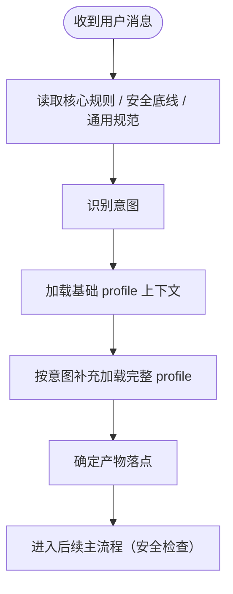

# ① 预检查流程图

> 本页聚焦主流程中的 `① 预检查` 阶段。  
> 当前仍为流程定义阶段，下面是 v1.0.0 的预检查骨架，不代表已实现代码。

---

## 预检查主链

---

## 预检查阶段输出

预检查阶段结束时，至少应产出以下基础信息：

1. 当前会话适用的规则基线
2. 当前任务意图分类结果
3. profile 上下文加载状态
4. 产物落点（报告、记忆、需求等）确定结果
5. 可供后续节点汇总的前置信息片段

---

## 与主流程关系

- 主流程入口见：[主流程图](/specs/flowcharts)
- 合规语义见：[合规检查框架](/specs/compliance-framework)
- 前置状态汇总见：[前置状态汇总流程图](/specs/pre-state-summary-flow)

> 约束：预检查是必经阶段，不可跳过。
