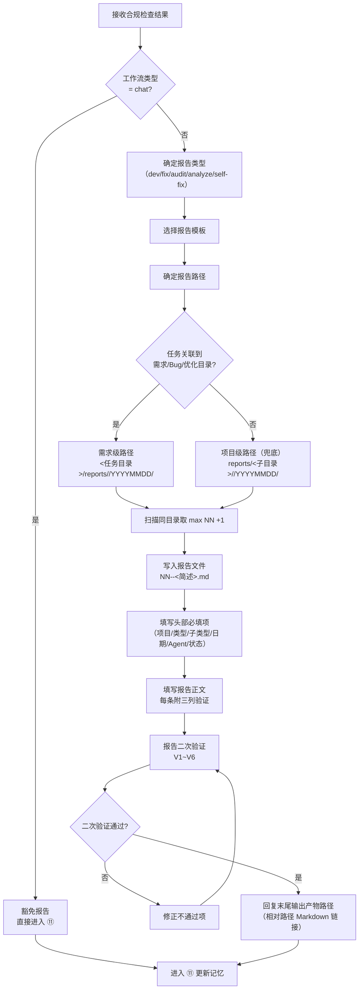

# ⑩ 输出报告流程图

> 本页聚焦主流程中的 `⑩ 输出报告` 阶段。  
> 该阶段在执行阶段合规检查通过后执行，负责生成并写入工作流执行报告。

---

## 报告输出主链

---

## 报告路径映射

| 工作流 | 项目级子目录 |
|--------|:-----------:|
| dev | `requirements/` |
| dev (optimization) | `optimizations/` |
| dev (scenario-test) | `scenario-tests/` |
| fix | `bugs/` |
| analyze | `analysis/` |
| audit | `audit/` |
| self-fix | `self-fix/` |

## 报告二次验证（V1~V6）

| # | 检查项 |
|:-:|--------|
| V1 | 每条问题有文件来源 |
| V2 | 验证列+标注完整 |
| V3 | ✅已验证 的问题确实读取了对应文件 |
| V4 | 纯推测性问题已标注 ⚠️待验证 |
| V5 | 每条 🔴 级问题通过反向质疑三问 |
| V6 | 🔴 级占比超 1/3 时触发分级自检 |

---

## 阶段输出要求

1. 报告必须写入文件（禁止仅在对话中输出）
2. 每条建议/问题必须附三列验证（合理性+可实施性+收益）
3. 文件名使用 `NN--` 双横杠格式
4. 报告末尾引用本次会话记忆路径
5. 回复末尾必须输出 `📂 本次会话产物` 区块与相对路径 Markdown 链接

---

## 与主流程关系

- 主流程入口见：[主流程图](/specs/flowcharts)
- 上游阶段见：[⑨ 执行阶段合规检查流程图](/specs/exec-compliance-flow)
- 下游阶段见：[⑪ 更新记忆流程图](/specs/memory-update-flow)
- 报告规范见：`skills/report/SKILL.md`

> 约束：报告输出为主链必经阶段（chat 豁免），不可跳过。
