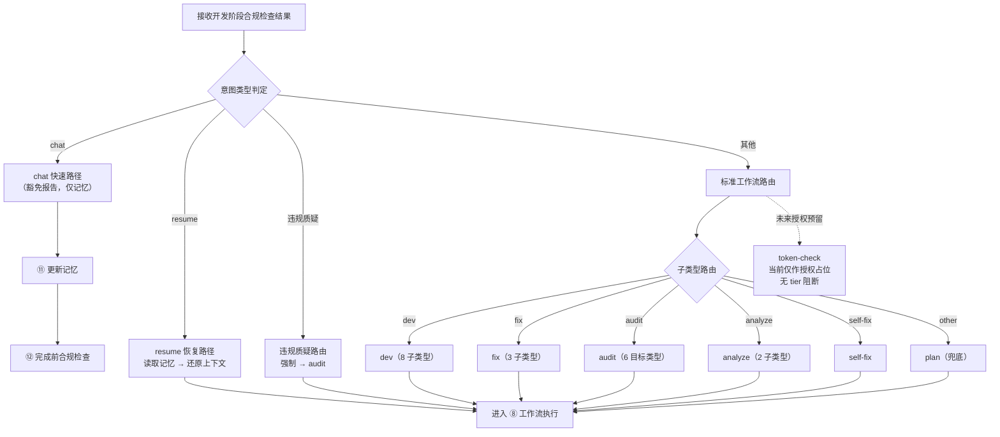

# ⑦ 路由到工作流流程图

> 本页聚焦主流程中的 `⑦ 路由到工作流` 阶段。  
> 路由逻辑内联在 Agent 文件中，本页为流程骨架描述。

---

## 路由主链

---

## 路由规则要点

1. **chat 快速路径**：三问法全指向分析 + 无文件变更意图 → 跳过 CP 和报告 → 仅写记忆
2. **resume 路径**：读取记忆（最近 14 天）→ 还原上下文 → 提取原始意图 → 重路由
3. **违规质疑**：用户质疑规范违反 → 强制路由到 audit → 先执行 compliance
4. **多意图处理**：≥2 意图 → 按序逐一路由，每个独立走完整工作流周期
5. **授权占位**：当前版本 `token-check` 仅说明所有功能全量开放；Token/Tier 校验保留给未来版本，不阻断 v1 工作流

---

## 与主流程关系

- 主流程入口见：[主流程图](/specs/flowcharts)
- 上游阶段见：[⑥ 开发阶段合规检查流程图](/specs/dev-compliance-flow)
- 下游阶段见：[⑧ 工作流执行流程图](/specs/workflow-execution-flow)
- 路由参考文档见：`skills/routing/SKILL.md`

> 约束：路由为主链必经阶段，不可跳过。chat / resume / 违规质疑为特殊路径。

