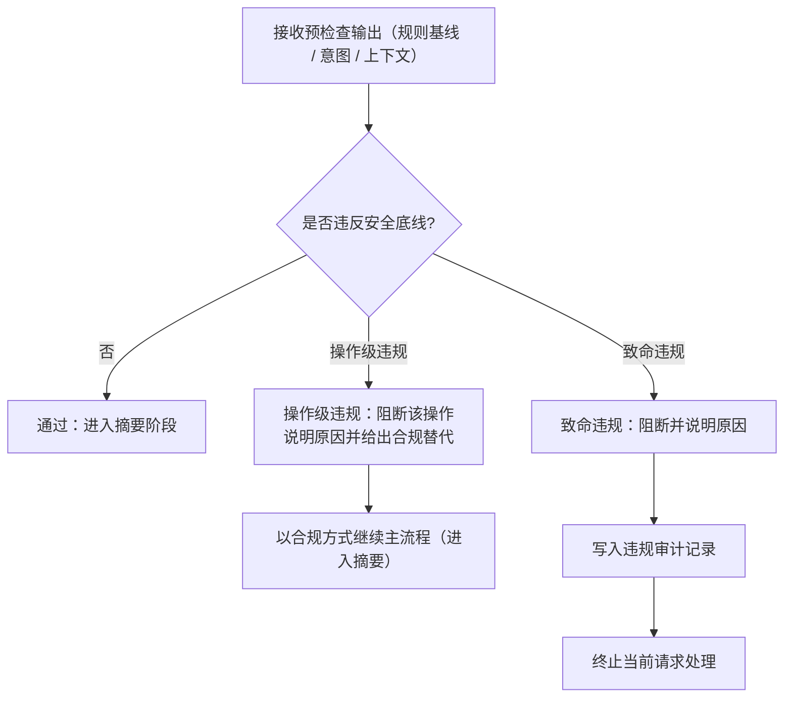

# 安全检查流程图

> 本页聚焦主流程中的 `② 安全检查` 阶段。  
> 当前仍为流程定义阶段，下面是 v1.0.0 的安全检查骨架，不代表已实现代码。

---

## 安全检查主链

---

## 判定结果与后续动作

1. **通过**：继续主流程，进入“写入摘要”
2. **操作级违规**：阻断违规操作，给出合规替代后继续
3. **致命违规**：记录审计并终止，不再进入后续执行链

---

## 与主流程关系

- 主流程入口见：[主流程图](/specs/flowcharts)
- 安全底线来源见：`ai-dev-guidelines/version/v4/specs/safety.md`
- 操作级违规处理细图见：[阻断并给出合规替代流程图](/specs/block-op-flow)

> 约束：安全检查是必经阶段，不可跳过。
