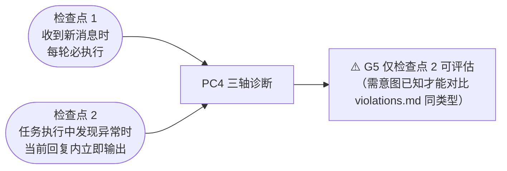
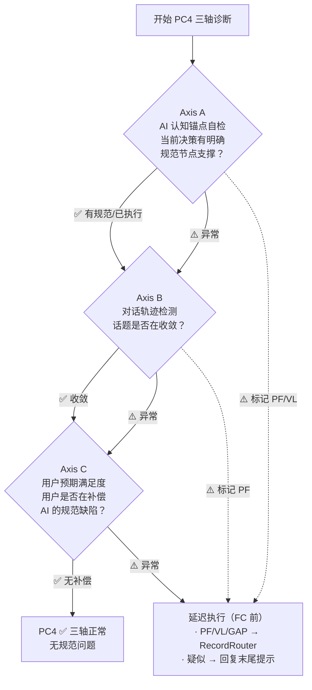
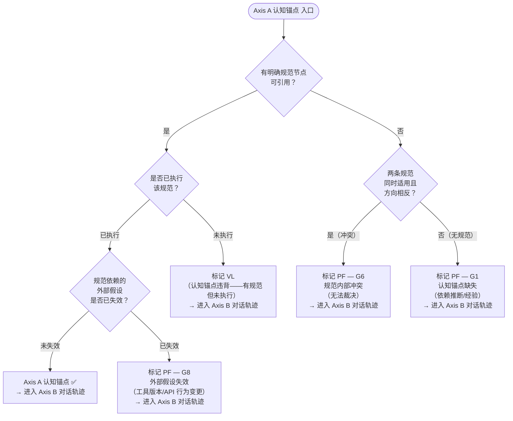
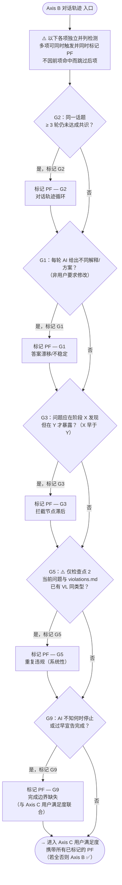
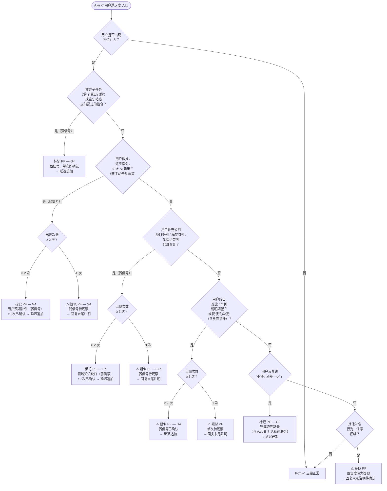
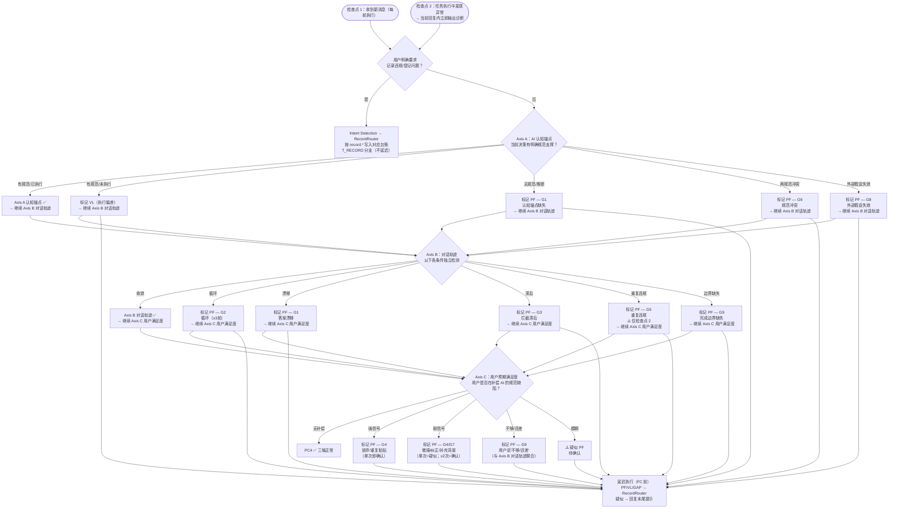
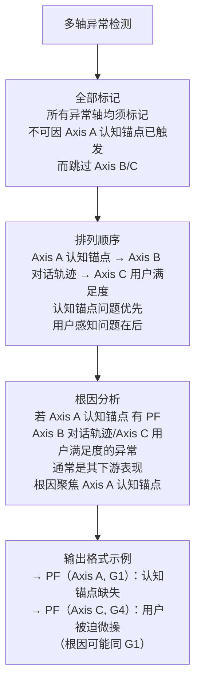
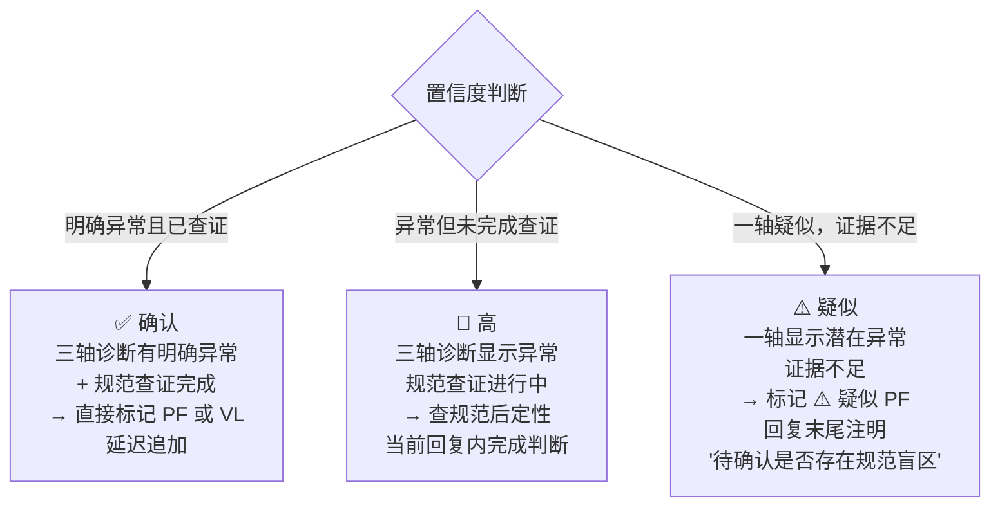
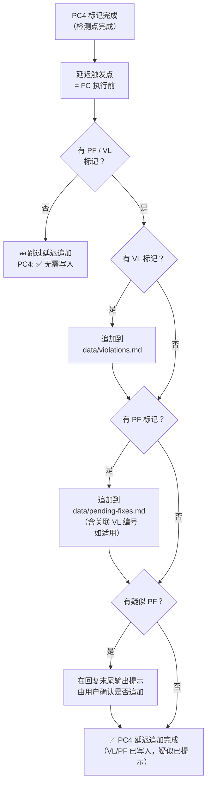

# PC4 规范雷达流程图

> 本页为 `① 预检查` 阶段中 PC4 节点的专属可视化。  
> PC4（规范原因识别）是 DevCodex 的规范自我升级机制的感知层，**仅 dev 模式生效**；prod 模式跳过全部 PC4 逻辑。  
> 完整规范定义见：`18-spec-radar.instructions.md`

---

## 设计定位

| 对比项 | PC4 规范雷达 | 合规检查（FC/SC） |
|--------|:-----------:|:----------------:|
| 时机 | 任务执行**前/中** | 任务完成**后** |
| 诊断对象 | **规范本身**是否存在缺陷 | AI 是否遵守了规范 |
| 输出 | `record.*` 规范化意图 + PF/VL/GAP 等证据 | 通过 / 不通过 |
| 修复 | 经 RecordRouter 写入对应台账（不立即修复）| 内联修正后重检 |

> 设计原则：**记录在使用，修复在维护**。PC4 只感知并记录，不触发任何修复动作；记录动作由 `spec-governance` 执行意图识别 → RecordRouter 分流，避免把“违规”“规范缺陷”“过程改进”“待排期问题”“审计空白”混写到同一台账。

### RecordRouter 分流口径

| 规范化意图 | 目标台账 |
|------------|----------|
| `record.violation` | `data/violations.md` |
| `record.spec-defect` | `data/pending-fixes.md` |
| `record.process-improvement` | `data/process-improvements.md` |
| `record.pending-issue` | `data/pending-issues.md` |
| `record.audit-gap` | `data/gap-registry.md` |
| `record.none` / `record.ambiguous` | 不写入；先解释或澄清 |

---

## 触发检查点



---

## 三轴诊断模型总览

PC4 通过三个轴评估交互底层状态，**不依赖关键词匹配**，由轴的诊断结论决定是否触发。



> ℹ️ **全轴检查原则**：任意轴发现异常后，必须继续检查后续轴（不早退出）。所有标记集中在延迟执行阶段统一追加。

---

## Axis A — AI 认知锚点决策树



---

## Axis B — 对话轨迹决策树



---

## Axis C — 用户预期满足度决策树



---

## 完整 PC4 决策流程（含前置分支）



> ℹ️ **Axis A 互斥原则**：AI 对同一决策只能处于一种认知状态，五条出口为互斥选择，每种结果都继续 Axis B。  
> ℹ️ **Axis B 独立触发原则**：六条分支（G2/G1/G3/G5/G9 + 正常）**相互独立，可同时标记**；流程图简化为辐射形展示，完整的逐项独立检测逻辑详见 [Axis B 子图](#axis-b--对话轨迹决策树)。  
> ℹ️ **全轴检查原则**：任意轴发现异常后必须继续检查后续轴（不早退出），所有标记集中在延迟执行阶段统一追加。

---

## 多轴异常优先级规则

当三轴诊断中**多轴同时出现异常**时：



### 多轴输出格式

```
- PC4 规范雷达：[Axis A ⚠️] [Axis B ✅] [Axis C ⚠️]
  → ⚠️ PF 标记（G1）：AI 依赖推断而非规范节点 · 延迟追加 pending-fixes.md
  → ⚠️ PF 标记（G4）：用户被迫微操补充细节 · 延迟追加（根因可能同 G1）
```

> G 码在同轴内用逗号合并（如 `G1, G6`），跨轴分行显示。

---

## 置信度与处理规则



---

## 完整触发场景（G1~G11）

| 编号 | 名称 | 触发轴 | 判别阈值 | 典型表现 |
|:----:|------|:------:|:-------:|---------|
| **G1** | 认知锚点缺失 | A / B¹ | 单次即触发 | AI 使用"我认为/可能/视情况"；同类问题跨会话答案不一致；AI 将规范应决定的事抛给用户；需要大段理由论证而非引用规范节点 |
| **G2** | 对话轨迹循环 | B | ≥3 轮未收敛 | 同一话题反复讨论无结论；用户换表达方式 AI 仍无稳定答案 |
| **G3** | 拦截节点滞后 | B | 单次即触发 | 应在 CP1 发现的问题执行阶段才暴露；应在 plan-review 拦截的缺陷在 Audit 才发现；AI 未完成规定前置检查就推进了流程；跨会话恢复后跳过预检查直接执行任务（高频场景）|
| **G4** | 用户预期补偿 | C | 强信号单次；弱信号≥2次 | 用户开始逐步指令；重复粘贴之前说过的话；放弃子任务（"算了我自己做"）|
| **G5** | 重复违规（系统性）| A+B | 单次即触发（⚠️ 仅检查点 2）| 当前问题与 `violations.md` 已有 VL 同类型，表明已有 VL 未转化为规范改进 |
| **G6** | 规范内部冲突 | A | 单次即触发 | 两条规范同时适用且指向不同方向，AI 无法裁决 |
| **G7** | 领域知识缺口 | C | 单次=疑似；≥2次=确认 | 用户在对话中教 AI 项目惯例/框架特性/架构约束 → profile 或规范应覆盖但未包含 |
| **G8** | 外部假设失效 | A | 单次即触发 | AI 严格按规范执行，但工具版本/API 行为等外部环境假设已改变，导致结果异常 |
| **G9** | 完成边界缺失 | B+C | 单次=疑似；≥2次=确认 | AI 不知何时停止（持续追加内容）；AI 过早宣告完成；用户反复说"不够/还差一步" |

> ¹ G1 主触发轴为 Axis A（认知锚点缺失），同时也可由 Axis B 漂移（AI 答案每轮不同）独立触发。

---

## 延迟执行流程



> ⛔ **禁止遗漏**：只要 PC4 标记了 ⚠️（含疑似），任务完成时必须有对应输出；SC4 检查此项。  
> ℹ️ **检查点 2 回溯**：任意 Axis 检测到异常，必须在当前回复中立即完成诊断并输出，不得等待下轮消息。  
> ⛔ **禁止关键词触发**：不得仅因用户用了某个词汇而触发 PC4；必须经三轴诊断确认存在底层状态异常。

---

## 与主流程关系

- 主流程入口见：[主流程图](/specs/flowcharts)
- 预检查主链见：[① 预检查流程图](/specs/precheck-flow)
- 合规检查框架见：[合规检查框架](/specs/compliance-framework)
- 完整规范定义见：`18-spec-radar.instructions.md`（三轴诊断模型 + G1~G11 + 决策流程 + 输出格式）
