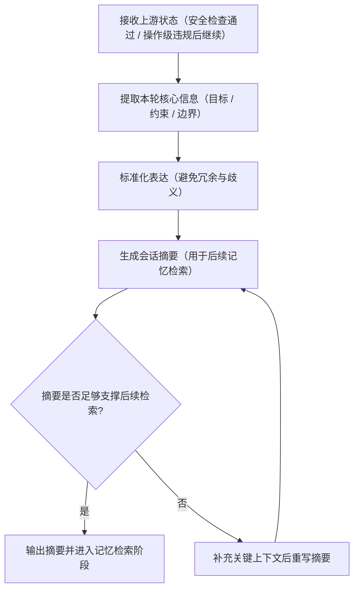

# ③ 写入摘要流程图

> 本页聚焦主流程中的 `③ 写入摘要` 阶段。  
> 当前仍为流程定义阶段，下面是 v1.0.0 的摘要流程骨架，不代表已实现代码。

---

## 写入摘要主链

---

## 阶段输出要求

1. 摘要必须覆盖：本轮目标、关键约束、执行边界
2. 摘要应服务后续“记忆检索”，避免只写表面描述
3. 摘要应简洁且可复用，不应夹杂执行细节噪音

---

## 与主流程关系

- 主流程入口见：[主流程图](/specs/flowcharts)
- 上游分支见：[安全检查流程图](/specs/safety-check-flow)

> 约束：写入摘要在主链中为必经阶段，不可跳过。
