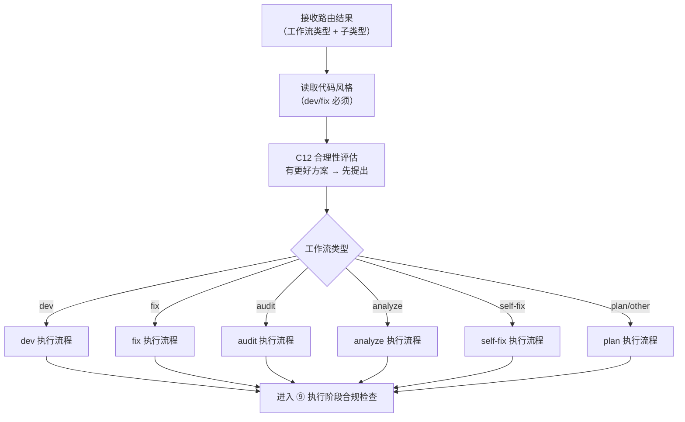
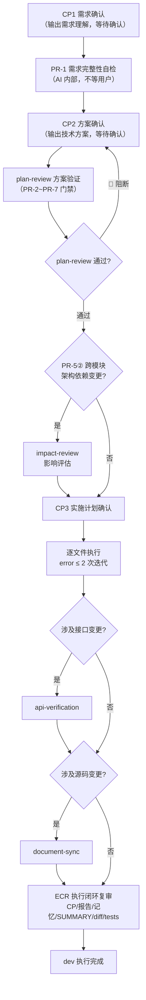
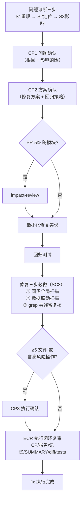
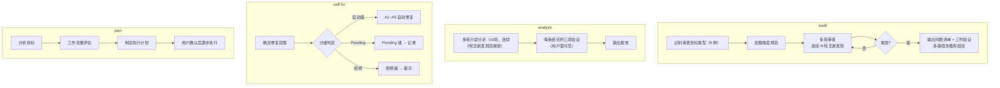

# ⑧ 工作流执行流程图

> 本页聚焦主流程中的 `⑧ 工作流执行` 阶段。  
> 各工作流有独立的执行细节，本页展示统一的执行骨架与分支。

---

## 工作流执行总览

---

## dev 执行流程

---

## fix 执行流程

---

## audit / analyze / self-fix / plan 执行骨架

---

## 阶段输出要求

1. 工作流执行必须按对应 Skill 规范完整执行
2. dev/fix 编码后必须运行 lint/typecheck/test；TypeScript 项目优先项目既有 `typecheck`，否则至少执行 1 次 `tsc --noEmit` 这类无产物校验（error ≤ 2 次迭代）
3. 2 次仍失败 → 停止，输出错误摘要标 ⚠️ 等待用户决策
4. 执行完成后进入 ⑨ 执行阶段合规检查

---

## 与主流程关系

- 主流程入口见：[主流程图](./flowcharts)
- 上游阶段见：[⑦ 路由到工作流流程图](./routing-flow)
- 下游阶段见：[⑨ 执行阶段合规检查流程图](./exec-compliance-flow)

> 约束：工作流执行为主链必经阶段，不可跳过。
