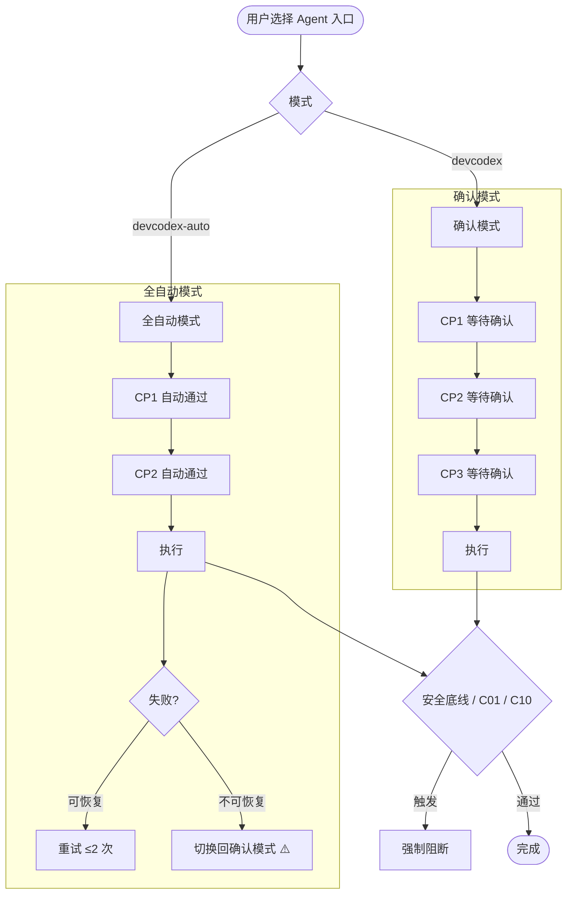

# Agent 双模式 — 需求概况

> **优先级**：P1 · **状态**：⬜ 待开发

---

## 需求背景

当前 DevCodex 仅支持"确认模式"——每个 CP 节点都需要用户明确确认才继续执行。  
用户需要一种"全自动模式"用于快速迭代、CI/CD 场景或熟悉流程后的批量操作。

---

## 需求定义

### 模式一：确认模式（默认）

- CP1 → CP2 → CP3 每个节点等待用户 yes/no
- 合规检查结果展示，等待用户继续
- 适用场景：正式开发、架构变更、生产部署

### 模式二：全自动模式

- 跳过所有 CP 节点确认，AI 自主判断并继续执行
- 合规检查仍执行，失败时自动修正后继续（不暂停等待用户）
- 适用场景：CI/CD 流水线、批量重构、用户已熟悉流程

### 切换方式

- **默认**：选择对应 Agent 入口（会话级）
- **可选**：在 `.devcodex/profile/01-项目信息.md` 中声明 `execution-mode: auto`（项目级，低优先级）

---

## 约束条件

| 约束 | 确认模式 | 全自动模式 |
|------|---------|-----------|
| CP1/CP2/CP3 等待确认 | ✅ 必须 | ❌ 跳过 |
| 安全底线 S01~S06 | ✅ 必须 | ✅ **不可跳过** |
| C01 不可逆操作确认 | ✅ 必须 | ✅ **不可跳过** |
| C10 危险命令确认 | ✅ 必须 | ✅ **不可跳过** |
| 合规检查 FC/SC | ✅ 执行 | ✅ 执行（失败自动修正）|
| 记忆 & 报告写入 | ✅ 自动 | ✅ 自动 |

**失败回退规则（全自动模式）：**
- 可恢复错误（如 lint 失败）：自动重试 ≤2 次，仍失败则停止标 ⚠️
- 不可恢复错误（安全底线触发）：立即终止，切换回确认模式等待用户决策

---

## 流程图

---

## 验收标准

- [ ] 双 Agent 入口可被 VS Code Copilot 加载
- [ ] 全自动模式下 CP 节点不等待用户确认
- [ ] 全自动模式下 S01/C01/C10 仍正确阻断
- [ ] 失败时正确切换回确认模式并输出摘要
- [ ] profile 配置的 `execution-mode: auto` 生效

---

## 关联需求

| 关联 | 关系 |
|------|------|
| [P2 — agents/](../../p2/agents) | 实现位置：双 Agent 文件在此目录 |
| [P2 — skills-core](../../p2/skills-core) | `cp-gate` Skill 需增加全自动分支 |

---

## 开发文档

| 文档 | 状态 |
|------|------|
| [技术方案](./design) | ⬜ 待撰写 |
| [实施计划](./plan) | ⬜ 待制定 |
| [实施进度](./progress) | ⬜ 未开始 |
| [关键决策](./decisions) | D-001 已记录 |

---

## 版本变更记录

| 版本 | 日期 | 变更内容 |
|------|------|---------|
| v1.0.0 | 2026-04-04 | 初始需求定义，切换方式由 `auto:` 指令改为双 Agent 入口（D-001）|
