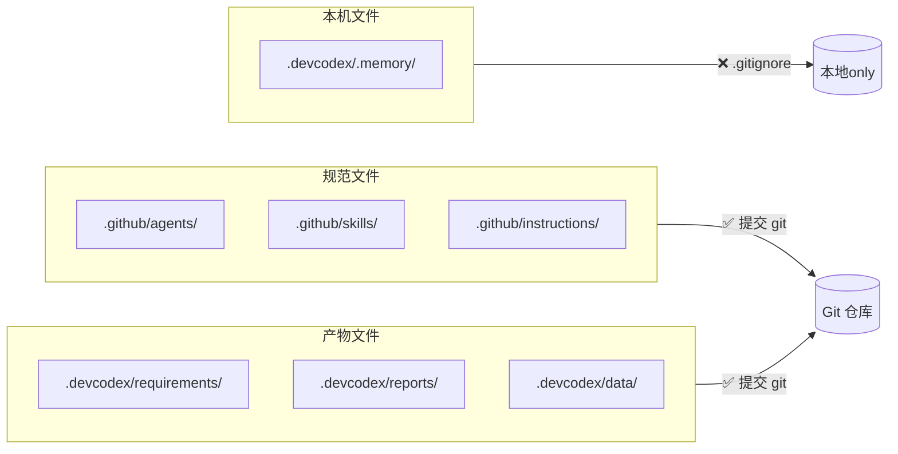

# 存储规范 — 需求概况

> **优先级**：P1 · **状态**：⬜ 待开发

---

## 需求背景

DevCodex 在用户项目中产生多类文件（规范文件、需求产物、记忆文件、报告等），当前缺少统一的存储位置规范，各 Skill 各自散落写文件，导致路径不一致、记忆文件被意外提交、产物难以查找。需要建立一套明确的存储目录规范，作为所有其他规范的基础。

---

## 需求定义

### 双根目录原则

| 目录 | 用途 | 是否提交 |
|------|------|---------|
| `<工作区>/.github/` | DevCodex 规范文件（agents/skills/instructions/prompts/hooks）| ✅ 提交 |
| `<工作区>/.devcodex/` | DevCodex 产物（需求/报告/记忆/数据/profile）| 分类提交 |

### .devcodex/ 目录结构

```
<工作区>/.devcodex/
├── .memory/                     ← 记忆文件（❌ 不提交）
│   └── clients/<agent>/tasks/YYYYMMDD.md
├── requirements/<中文描述>/      ← 需求产物（✅ 提交）
├── bugs/<中文描述>/              ← Bug 修复产物（✅ 提交）
├── optimizations/<中文描述>/     ← 优化产物（✅ 提交）
├── reports/                      ← 全局报告（✅ 提交）
│   ├── analysis/<agent>/YYYYMMDD/
│   ├── audit/<agent>/YYYYMMDD/
│   ├── bugs/<agent>/YYYYMMDD/
│   └── requirements/<agent>/YYYYMMDD/
├── data/                         ← 运行时数据（✅ 提交）
│   ├── violations.md
│   ├── pending-fixes.md
│   └── gap-registry.md
├── profile/                      ← 项目规范（✅ 提交）
│   ├── 01-项目概述.md
│   ├── 02-技术栈.md
│   └── 03-代码风格.md
├── TASK-INDEX.md                 ← 任务索引（✅ 提交）
└── README.md
```

### 记忆文件规范

- 路径：`.devcodex/.memory/clients/<agent>/tasks/YYYYMMDD.md`
- 每天一个文件，`## 会话 NN` 分段，只追加不覆盖
- `<agent>` 取值：`copilot` / `cursor` / `claude` / `unknown-agent`

### 报告命名规范

```
NN--<简述>.md   （双横杠，NN 从 01 起递增）
```

### .gitignore 规则

```bash
.devcodex/.memory/
.devcodex/**/.memory/
.devcodex/**/.tmp/
```

---

## 约束条件

- ⛔ 所有记忆读写必须通过 `memory` Skill 代理，不可在各 Skill 中直接散落写文件
- ⛔ 报告写入必须通过 `report` Skill 代理
- ⛔ 禁止使用 glob/find 扫描 `.memory/` 隐藏目录
- ⛔ 禁止用终端命令（`Set-Content`/`sed -i`）修改 .md 文件（破坏 UTF-8）
- 以上统一接口为 v2.0.0 替换 MongoDB 存储层预留替换点

---

## 流程图



---

## 验收标准

- [ ] `.devcodex/` 目录结构与规范一致
- [ ] `.gitignore` 正确排除 `.memory/` 和 `.tmp/`
- [ ] 所有 Skill 的记忆写入均通过 `memory` Skill 代理
- [ ] 所有报告写入均通过 `report` Skill 代理
- [ ] 报告文件名符合 `NN--<简述>.md` 规范

---

## 关联需求

| 关联 | 关系 |
|------|------|
| [P1 — 记忆恢复 & Resume](../memory-resume/) | 依赖本规范的记忆文件路径和读取规则 |
| [P2 — skills-core](../../p2/skills-core) | `memory` / `report` Skill 实现本规范的统一接口 |

---

## 开发文档

| 文档 | 状态 |
|------|------|
| [技术方案](./design) | ⬜ 待撰写 |
| [实施计划](./plan) | ⬜ 待制定 |
| [实施进度](./progress) | ⬜ 未开始 |
| [关键决策](./decisions) | 暂无 |

---

## 版本变更记录

| 版本 | 日期 | 变更内容 |
|------|------|---------|
| v1.0.0 | 2026-04-04 | 初始需求定义，确立双根目录原则与统一存储接口约束 |
