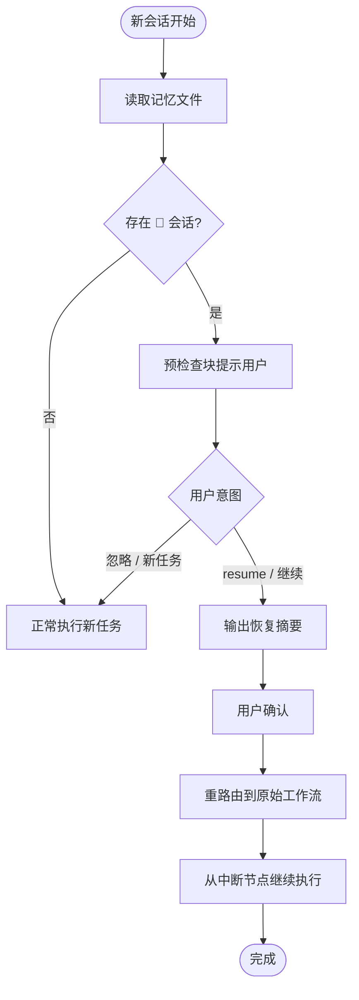

# 记忆恢复 & Resume — 需求概况

> **优先级**：P1 · **状态**：⬜ 待开发

---

## 需求背景

AI 会话是无状态的——每次新会话上下文清空。DevCodex 通过记忆文件（`.devcodex/.memory/`）实现跨会话状态持久化，但当前缺少完整的规范：新会话如何加载历史记忆、如何从中断节点恢复执行。需要建立"记忆加载 + Resume 工作流"的完整闭环。

---

## 需求定义

### 需求一：新会话记忆加载

每次新会话开始时（收到首条用户消息）自动执行：

```
① 读取当天记忆文件（YYYYMMDD.md）
② 检查是否存在状态为 🔄 的会话段落
③ 如果存在 → 预检查状态块中提示用户
④ 读取 TASK-INDEX.md 了解当前活跃任务列表
```

预检查状态块格式：

```
---
🔍 预检查（DEV 模式）
- Token 轮次：第 1 轮
- 待跟进事项：⚠️ 上次有待跟进：[简述]
- 未完成任务：⚠️ 存在 🔄 会话：[简述] → 建议先 resume
---
```

### 需求二：Resume 工作流

触发条件（同时满足）：
1. 用户说"继续" / "恢复" / "resume"
2. 记忆中存在状态为 🔄 的会话

执行流程：
```
① 读取最近 🔄 状态会话
② 解析任务摘要 + 编码检查点 + 最后执行节点
③ 输出恢复摘要，等待确认
④ 重路由到原始工作流，从中断节点继续
```

### 需求三：TASK-INDEX.md 维护

路径：`.devcodex/TASK-INDEX.md`

| 任务 ID | 描述 | 工作流 | 状态 | 最后更新 | 记忆文件 |
|---------|------|--------|------|---------|---------|
| T001 | 示例任务 | dev > default | 🔄 进行中 | 2026-04-04 | `.memory/.../20260404.md#会话01` |

维护规则：新建任务追加 🔄，完成更新为 ✅。

---

## 约束条件

- ⛔ 禁止使用 glob/find 扫描 `.memory/` 隐藏目录，必须逐层进入
- ⛔ chat 类任务不产生 🔄 状态，resume 不处理 chat 历史
- ⛔ 同一会话内不可 resume（仅跨会话使用）
- 全自动模式（`devcodex-auto`）下记忆中有 🔄 任务时，自动恢复并继续（无需用户确认）

---

## 流程图



---

## 验收标准

- [ ] 新会话预检查正确显示 🔄 待续任务
- [ ] `resume` 触发时读取最近 🔄 会话并输出摘要
- [ ] 恢复后正确重路由到原始工作流
- [ ] 全自动模式下自动恢复 🔄 任务（无需确认）
- [ ] TASK-INDEX.md 在任务创建/完成时自动维护

---

## 关联需求

| 关联 | 关系 |
|------|------|
| [P1 — 存储规范](../storage-spec/index) | 前置依赖：记忆文件路径与读写规则由存储规范定义 |
| [P2 — skills-core](../../p2/skills-core) | `memory` Skill 实现记忆读写；`intent` Skill 识别 resume 意图 |

---

## 开发文档

| 文档 | 状态 |
|------|------|
| [技术方案](./design) | ⬜ 待撰写 |
| [实施计划](./plan) | ⬜ 待制定 |
| [实施进度](./progress) | ⬜ 未开始 |
| [关键决策](./decisions) | 暂无 |

---

## 版本变更记录

| 版本 | 日期 | 变更内容 |
|------|------|---------|
| v1.0.0 | 2026-04-04 | 初始需求定义，确立记忆加载、Resume 工作流、TASK-INDEX 三项规范 |
