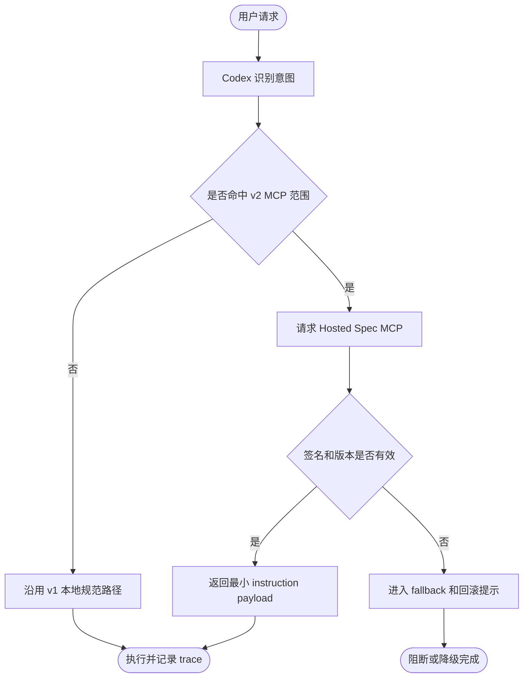

# v2 一期正式方案包

> **状态**：📋 方案冻结草案  
> **关联规则**：`V2FormalSolutionPackage`、`V2MCPFirstPlanningGate`

## CP1 需求边界

v2.0.0 一期默认目标是 Intent-Gated Hosted Spec MCP 的 Codex-only 可验证 MVP。核心价值是让 Codex 在识别意图后，从托管 MCP 获取最小必要规范片段、私有可追踪 docs 和验证证据，而不是继续依赖本地规则正文副本。

一期必须覆盖：

- 意图门禁：根据 dev/fix/audit/analyze/self-fix/chat/resume 等意图请求对应规范片段。
- MCP API contract：提供 workflow/spec/profile 片段查询、trace id、版本签名和 fallback 信息。
- 最小 instruction return：只返回当前任务必要片段、证据链接和校验摘要，不返回整套规则正文。
- 可见性分层：Codex 可见、维护者可见、用户正式文档可见三层分离。
- Codex-only 验证矩阵：先验证 Codex 宿主链路、降级路径、缓存/签名/回滚和报告证据。

一期默认排除：

- MongoDB 数据层、控制台、多租户自定义工作流。
- 本地持久化缓存规则正文。
- 安装 `.github` / `CLAUDE.md` / `AGENTS.md` 作为默认分发方式。

## CP2 技术方案

| 模块 | 职责 | 输入 | 输出 | 验证 |
|------|------|------|------|------|
| Intent Gate | 将用户意图映射到可请求的规范片段集合 | intent、project profile、host surface | spec request | intent fixture replay |
| Hosted Spec MCP | 返回最小规范片段、版本、签名和 trace | spec request、tenant/project scope | instruction return | MCP contract test |
| Visibility Layer | 区分 Codex、维护者和正式用户文档 | audience、permission、doc class | filtered payload | visibility snapshot |
| Cache / Signature / Rollback | 防止旧规则或篡改规则静默生效 | version、signature、ttl、rollback id | verified payload / fallback | signature replay |
| Registry / Marketplace | 管理可发布规范包与插件入口 | package metadata、version、channel | registry entry | pack/install smoke |
| Private Maintainer Site | 维护者查看 trace、版本、验证矩阵 | trace id、build id、validation status | maintainer page | Browser/截图证据 |

## MCP API Contract

| API | 用途 | 最小字段 | 失败策略 |
|-----|------|----------|----------|
| `devcodex.resolveIntent` | 返回意图和候选规范片段 | `intent`、`confidence`、`specKeys`、`traceId` | 低置信度返回澄清建议 |
| `devcodex.getSpecFragments` | 获取最小规范片段 | `specKeys`、`version`、`signature`、`fragments` | 签名失败进入 fallback |
| `devcodex.getValidationEvidence` | 获取当前版本验证证据 | `version`、`checks`、`artifacts`、`traceId` | 证据缺失时阻断发布声明 |
| `devcodex.rollbackSpecVersion` | 维护者回滚规范版本 | `fromVersion`、`toVersion`、`reason`、`traceId` | 回滚失败保留当前稳定版本 |

## Mermaid 流程

### 节点说明

**N2 Codex 识别意图**：根据用户消息、项目 Profile 和当前宿主能力生成 intent、confidence 与候选 spec keys。成功进入 N3；低置信度时要求澄清。

**N3 是否命中 v2 MCP 范围**：判断当前任务是否属于 Codex-only MCP MVP。命中进入 N4；未命中回落 N8。

**N4 请求 Hosted Spec MCP**：使用 spec keys、版本约束和 trace id 请求最小规范片段。成功进入 N5；网络或权限失败进入 N7。

**N5 签名和版本是否有效**：校验返回片段签名、版本和 ttl。有效进入 N6；无效进入 N7。

**N6 返回最小 instruction payload**：只返回当前任务必要规则、证据链接和校验摘要。成功进入 N9；片段缺失时回 N7。

**N7 进入 fallback 和回滚提示**：记录失败原因、trace id 和可回滚版本，不宣称 v2 链路完成。可恢复后重试 N4。

**N8 沿用 v1 本地规范路径**：不在一期范围内的任务继续使用 v1 本地规范源，避免把远景能力伪装成一期已支持。
